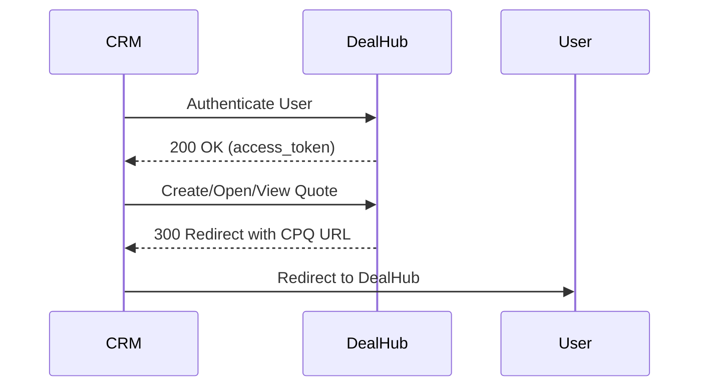

# Introduction to DealHub APIs

DealHub is a quote-to-cash ecosystem that unifies CPQ (Configure, Price, Quote), CLM (Contract Lifecycle Management), subscription management, and revenue recognition. While this documentation currently focuses on CPQ APIs, future releases will expand the API features available.

## How DealHub CPQ Works

The core of the user experience (for salespeople)  is the **Playbook**. A sales representative navigates a guided selling questionnaire, and based on their answers, the system automatically:

- Generates the appropriate products.
- Calculates pricing based on predefined rules.
- Applies any necessary discounts or approval workflows.

This automated process replaces manual methods like using spreadsheets for pricing calculations and static templates for output documents.  
An admin can also quickly update any changes to the entire organization, such as updating the design of output documents. 

The platform is designed to be tailored for each specific customer's needs.

DealHub is governed by the customer's primary CRM, and the quoting process typically begins within the CRM. The platform has native connectors for major CRMs like Salesforce, HubSpot, and Microsoft Dynamics. The platform also supports sales through partner channels by integrating with Partner Relationship Management (PRM) systems.

The final output can be a traditional document (PDF, Word, Excel) or an interactive **DealRoom**. The DealRoom is a mini-website created for each sales opportunity, providing a central place for the customer to access pricing tables, files, and terms and conditions. Crucially, the DealRoom includes an e-signature widget, enabling customers to sign contracts directly within the platform.

## The DealHub API

The DealHub API suite is the toolset that allows your applications to interact with the platform. Before you dive in, it helps to understand a few core concepts.

[block:html]
{
  "html": "<style>\n  .card_container {\n    display: flex;\n    flex-direction: column;\n    gap: 16px;\n    margin: auto;\n    justify-content: center;\n    align-items: center;\n    width: 100%;\n  }\n\n  .card_container1 .card {\n    border-radius: 10px;\n    border: 1px solid #DDD;\n    background: #FFF;\n    display: flex;\n    flex-direction: column;\n    padding: 16px;\n    width: 100%;\n    max-width: 800px;\n    transition: all 0.3s ease, border 0.1s ease;\n  }\n\n.card_container1 .card.clickable:hover {\n  cursor: pointer;\n  border-color: #22D1AF;\n  box-shadow: 0 10px 20px #282a3017;\n  transform: translateY(-2px);\n}\n\n.card_container1 .card.clickable:hover .card_text h3 {\n  color: #22D1AF;\n}\n\n  .card_container1 .card_text h3 {\n    margin: 0 0 8px 0;\n    font-size: 18px;\n    font-weight: bold;\n    color: #163B70;\n    transition: color 0.3s ease;\n  }\n\n  .card_container1 .card_text p {\n    margin: 0;\n    font-size: 14px;\n    line-height: 1.6;\n    color: #09143A;\n  }\n\n  .card_container1 .card:hover .card_text h3 {\n    color: #22D1AF;\n  }\n\n  @media (prefers-color-scheme: dark) {\n    [data-color-mode=\"system\"] .card_container1 .card,\n    [data-color-mode=\"dark\"] .card_container1 .card {\n      border: 1px solid #38434B !important;\n      background: #20282E !important;\n    }\n\n    [data-color-mode=\"system\"] .card_container1 .card:hover,\n    [data-color-mode=\"dark\"] .card_container1 .card:hover {\n      border-color: #22D1AF !important;\n    }\n\n    [data-color-mode=\"system\"] .card_container1 .card_text h3,\n    [data-color-mode=\"system\"] .card_container1 .card_text p,\n    [data-color-mode=\"dark\"] .card_container1 .card_text h3,\n    [data-color-mode=\"dark\"] .card_container1 .card_text p {\n      color: #FFF;\n    }\n  }\n</style>\n\n<section class=\"card_container card_container1\">\n  <div class=\"card\" >\n    <div class=\"card_text\">\n      <h3>CRM-Governed</h3>\n      <p>DealHub operates as a satellite to the primary CRM. The process usually starts in the CRM, and our APIs often rely on identifiers that originate there.</p>\n    </div>\n  </div>\n  <div class=\"card\" >\n    <div class=\"card_text\">\n      <h3>Version-Based Configuration</h3>\n      <p>Most of the business logic, including products, pricing, and API configurations like External Queries, is encapsulated within a Version. Many API calls will function in the context of the currently active version.</p>\n    </div>\n  </div>\n  <div class=\"card\" >\n    <div class=\"card_text\">\n      <h3>A Hybrid Approach (API & UI)</h3>\n      <p>Our APIs are built for system-to-system automation. While many tasks can be fully automated, the APIs and the UI are designed to work together. For example, an API can create a draft renewal quote, and a sales rep can then log into the UI to make final adjustments before sending it to the customer.</p>\n    </div>\n  </div>\n</section>"
}
[/block]


### What You Can Do: Our API Categories

Our APIs are grouped into categories based on their primary function:

[block:html]
{
  "html": "<style>\n  .card_container2 {\n    display: flex;\n    flex-wrap: wrap;\n    gap: 20px;\n    justify-content: center;\n    width: 100%;\n    max-width: 1000px;\n    margin: auto;\n  }\n\n  .card_container2 .card {\n    box-sizing: border-box;\n    width: calc(50% - 10px);\n    border-radius: 10px;\n    border: 1px solid #DDD;\n    background: #FFF;\n    padding: 16px;\n    display: flex;\n    flex-direction: column;\n    transition: all 0.3s ease, border 0.1s ease;\n  }\n\n  .card_container2 .card:hover {\n    cursor: pointer;\n    border-color: #22D1AF;\n    box-shadow: 0 10px 20px #282a3017;\n    transform: translateY(-2px);\n  }\n\n  .card_container2 .card_text h3 {\n    margin: 0 0 8px 0;\n    font-size: 18px;\n    font-weight: bold;\n    color: #163B70;\n    transition: color 0.3s ease;\n  }\n\n  .card_container2 .card_text p {\n    margin: 0;\n    font-size: 14px;\n    line-height: 1.6;\n    color: #09143A;\n  }\n\n  .card_container2 .card:hover .card_text h3 {\n    color: #22D1AF;\n  }\n\n  @media only screen and (max-width: 768px) {\n    .card_container2 .card {\n      width: 100%;\n    }\n  }\n\n  @media (prefers-color-scheme: dark) {\n    [data-color-mode=\"system\"] .card_container2 .card,\n    [data-color-mode=\"dark\"] .card_container2 .card {\n      border: 1px solid #38434B !important;\n      background: #20282E !important;\n    }\n\n    [data-color-mode=\"system\"] .card_container2 .card:hover,\n    [data-color-mode=\"dark\"] .card_container2 .card:hover {\n      border-color: #22D1AF !important;\n    }\n\n    [data-color-mode=\"system\"] .card_container2 .card_text h3,\n    [data-color-mode=\"system\"] .card_container2 .card_text p,\n    [data-color-mode=\"dark\"] .card_container2 .card_text h3,\n    [data-color-mode=\"dark\"] .card_container2 .card_text p {\n      color: #FFF;\n    }\n  }\n</style>\n\n<section class=\"card_container2\">\n  <div class=\"card\" onclick=\"window.location='/docs/quote-overview'\">\n    <div class=\"card_text\">\n      <h3>Quote Management</h3>\n      <p>Get information from DealHub, such as details about quotes, users, and versions, to use in your own applications like a BI system or internal dashboard.</p>\n    </div>\n  </div>\n<div class=\"card\" onclick=\"window.location='/docs/headless-api-overview'\">\n    <div class=\"card_text\">\n      <h3>Headless Quotes</h3>\n      <p>Generate a quote and perform actions (like submit or publish) entirely from a backend system, without any user interaction in the UI.</p>\n    </div>\n  </div>\n  <div class=\"card\" onclick=\"window.location='/docs/external-query-overview'\">\n    <div class=\"card_text\">\n      <h3>External Queries</h3>\n      <p>Fetch data from an external system and inject it directly into a quote's playbook to influence the configuration.</p>\n    </div>\n  </div>\n  <div class=\"card\" onclick=\"window.location='/docs/callouts-api-overview'\">\n    <div class=\"card_text\">\n      <h3>Callouts</h3>\n      <p>A specialized API used to fetch dynamic product pricing from an external system (like an ERP) at the moment a quote is being generated.</p>\n    </div>\n  </div>\n  \n</section>\n"
}
[/block]


## Next Steps

Authentication is required for all API calls. The method depends on the direction of the API call. To learn more about the authentication methods used by DealHub APIs, access the [Authentication](doc:authentication-overview) page.


# Authentication

Authenticating to the DealHub API ecosystem is primarily handled through a secure, token-based system. However, the specific method can vary depending on whether you are making a call to DealHub or receiving a call from DealHub. This guide provides a conceptual overview of the different authentication patterns.

## Standard API Authentication (Inbound)

For most system-to-system integrations where an external application calls a DealHub API endpoint, authentication uses a DealHub Authentication Token.

This method applies to the following APIs:

- Quote Open API
- Version Open API
- User Open API
- Pricing API
- Generate Quote and Actions API
- Partner API
- Pricing API

### How it Works

This process ensures that only authorized applications can access your DealHub data. It involves generating a secret key in DealHub and using it in your application's API requests.

> 🚧 API Key visibility
> 
> Make sure to copy your key as soon as you add it, you will not be able to see it again.

1. First, a CPQ administrator generates a secret `DealHub Authentication Token` within the DealHub system settings. To do this, navigate to **Control Panel > System Settings > API Settings** and click **Add**.

   [block:image]{"images":[{"image":["https://files.readme.io/03590b40673ace6eda27e0e04f71aab6153117b772c674c5ba34aa4ef9dfda34-create-key.png","",""],"align":"center"}]}[/block]
2. Securely share this token with your consuming application, which will be sending requests to DealHub.
3. For every API request, include the token in the `Authorization` header as a `Bearer` token. 

The following code snippet shows the use of the token in the request header to get all versions.

```curl
curl --location 'https://<YOUR_DEALHUB_URL>/api/v1/versions' \
--header 'Authorization: Bearer <SECRET_TOKEN_PROVIDED_BY_CPQ_ADMIN>'
```

If the token is missing or invalid, DealHub returns an `HTTP 403 Unauthenticated` error.

## Outbound Call Authentication (From DealHub)

When DealHub calls an external system (for example, for a WebHook, External Query, or Callout), the authentication method is configured within DealHub to match the requirements of the receiving endpoint.

The DealHub administrator can specify one of the following authentication types:

- **Token:** DealHub sends a secret bearer token in the `Authorization` header. Use this when the external endpoint is secured by a bearer token. This method uses the following header format:
- **Basic:** DealHub sends a username and password for Basic Authentication.
- **None:** Use this if the external endpoint does not require authentication or uses a different security method, such as a Shared Access Signature (SAS) token embedded directly in the URI.

## Partner API Authentication (PRM Integration)

Integrating a Partner Relationship Management (PRM) or partner portal involves a unique, two-step authentication process designed to securely grant partner users access to DealHub.

This flow consists of two main requests:

1. **Authenticate User (Server-to-Server):** Your partner system initiates a `POST` request to the `/api/v1/authenticate/user` endpoint. This request includes a long-lived authentication key (shared by the DealHub admin) and the partner's user information in the request body.
2. **Receive One-Time Token:** DealHub validates the request and returns a short-lived (60 seconds) access token.
3. **Open DealHub CPQ:** The one-time access token received from DealHub should be securely passed to the client. The client then makes a request to `/api/v1/open/quote` or `/api/v1/create/quote` using the token as a Bearer Token in the Authorization header. This request must come from the client side so that DealHub can return both a redirect URL and set an cookie in the browser, allowing the user to be automatically logged in to the DealHub portal.
4. **Get Redirect URL:** DealHub returns a unique URL that redirects the authenticated partner user to the appropriate page within the DealHub portal.

This process ensures that partner users are securely authenticated through the partner portal without needing direct DealHub login credentials.


# Error Reference

This page provides a reference for the HTTP error codes and associated messages you may encounter while using the DealHub APIs. The errors are organized into common errors that apply across multiple APIs and errors that are specific to a single API.

> 📘 V1 Endpoints
> 
> This page provides error references for the V2 endpoints, such as `GET /api/v2/quote/{id}` and `GET /api/v2/quotes`. For errors related to V1 endpoints, please see the [V1 Error Reference](doc:v1-error-reference).

> 🚧 Placeholders in Error Messages
> 
> Error messages often contain placeholders (e.g., `<PARAM_NAME>`, `<entity_id>`, `<MAX_LENGTH>`) that are replaced dynamically with specific values in the actual response.

> 📘 Asynchronous Errors
> 
> Failures for asynchronous operations, such as activating a new version, are sent via Failure WebHooks.

## Common Errors

These errors can be returned by multiple APIs and typically indicate an issue with the request's format, content, or authentication.

### Payload and Validation

| HTTP code | When it occurs                                                     | Error Message                                                                                 |
| :-------- | :----------------------------------------------------------------- | :-------------------------------------------------------------------------------------------- |
| 400       | The request payload is not in a valid JSON format.                 | `Invalid payload format. Supported format: JSON`                                              |
| 400       | A field in the request body exceeds its allowed character limit.   | `The request parameter <PARAM_NAME> exceeds its limits. Allowed maximum length: <MAX_LENGTH>` |
| 400       | A required field is missing from the request body.                 | `Request payload missing mandatory field(s): <field1>, <field2>`                              |
| 400       | The request includes a parameter that is not recognized.           | `Unrecognized parameter: <PARAM_NAME>`                                                        |
| 400       | A parameter is sent with a value that is not supported or invalid. | `<PARAMETER_NAME>` - Invalid parameter value. Valid value(s): `<VALID_VALUES>`                |

### Authentication

| HTTP code | When it occurs                                                             | Error Message     |
| :-------- | :------------------------------------------------------------------------- | :---------------- |
| 403       | The `Authorization` token is missing, invalid, or does not match the user. | `Unauthenticated` |

### Entity Not Found

| HTTP code | When it occurs                                                                               | Error Message                         |
| :-------- | :------------------------------------------------------------------------------------------- | :------------------------------------ |
| 400       | The requested entity ID (e.g., for a quote, user, or opportunity) does not exist in DealHub. | `Entity (ID = <entity_id>) not found` |

## API-Specific Errors

The following errors are unique to specific APIs.

### Actions API

The following errors are specific to the Actions API and may occur when performing submit, publish, or sign externally actions on quotes.

| HTTP Code | When it occurs                                                                                                                            | Error Message                                                                                                                                                |
| :-------- | :---------------------------------------------------------------------------------------------------------------------------------------- | :----------------------------------------------------------------------------------------------------------------------------------------------------------- |
| 400       | The quote cannot be submitted due to failing submit validation.                                                                           | `Submission failed: The quote did not pass submit validation requirements.`                                                                                  |
| 400       | The quote cannot be published due to failing submit validation.                                                                           | `Publish quote failed: The quote did not meet submit validation requirements.`                                                                               |
| 400       | The quote was created but cannot be signed due to failing submit validation.                                                              | `Sign externally failed: The quote did not pass submit validation requirements.`                                                                             |
| 400       | The quote cannot be published due to a required approval.                                                                                 | `Publish quote failed: Approval is required before the quote can be published.`                                                                              |
| 400       | The quote cannot be signed due to a required approval.                                                                                    | `Sign externally pending: Approval is required before the quote can be signed.`                                                                              |
| 400       | The quote cannot be submitted because it has already been submitted.                                                                      | `Submission failed: The quote has already been submitted.`                                                                                                   |
| 400       | The quote cannot be published; the quote document type is not DealRoom.                                                                   | `Publish quote failed: The quote's document type must be 'DealRoom' to proceed.`                                                                             |
| 400       | The quote cannot be published because it has already been published.                                                                      | `Publish quote failed: The quote has already been published.`                                                                                                |
| 400       | The quote cannot be published because its status is 'Draft'; it must be submitted first.                                                  | `Publish quote failed: The quote is in 'Draft' status and must be submitted first.`                                                                          |
| 400       | The quote cannot be signed because it has already been signed.                                                                            | `Sign externally failed: The quote has already been signed.`                                                                                                 |
| 400       | The quote cannot be signed externally.                                                                                                    | `Sign externally failed: The request cannot be processed.`                                                                                                   |
| 400       | Failed to sign externally; the quote is partially signed.                                                                                 | `Sign externally failed: The quote is currently in the signing process and cannot be signed externally at this stage.`                                       |
| 400       | Failed to sign externally; DealRoom has an active redline.                                                                                | `Sign externally failed: The DealRoom is in the redlining process. External signing is only allowed after redlining is completed.`                           |
| 400       | Failed to submit; the draft quote requires an update before submission.                                                                   | `Submission failed: The draft quote requires updates before it can be submitted. Complete updates via the DealHub UI.`                                       |
| 400       | Failed to sign externally; Because a published quote has already existed in the opportunity.                                              | `Sign externally failed: There is already another published quote's document type 'DealRoom' in the opportunity. Published the quote to sign it externally.` |
| 400       | Failed to sign the quote externally; The quote failed to sync.                                                                            | `Sign quote externally failed: The quote failed to sync.`                                                                                                    |
| 400       | Failed to sign the quote externally; The quote status is draft.                                                                           | `Sign quote externally failed: The quote is in a draft status.`                                                                                              |
| 400       | Failed to sign the quote externally; The option to multi-sign externally is on and the quote needs to be published to sign it externally. | `Sign quote externally failed: There is already a signed quote under the opportunity. The quote needs to be published first.`                                |

### Quote Open API

| HTTP Code | When it occurs                                                                                                | Error Message                                                                          |
| :-------- | :------------------------------------------------------------------------------------------------------------ | :------------------------------------------------------------------------------------- |
| 400       | A document is requested for a quote that is still in `Draft` status.                                          | `Cannot retrieve the document for the quote in 'Draft' status.`                        |
| 400       | A document is requested, but the quote was generated as an Excel file and has no document template specified. | `The quote does not have a template specified.`                                        |
| 400       | The requested document type (e.g., PDF, WORD) is not enabled for the quote's playbook.                        | `<DOCUMENT_TYPE> is not supported by the quote playbook.`                              |
| 400       | The requested file type for a submitted quote is different from the type it was originally generated with.    | `Cannot generate <DOCUMENT_TYPE> for the submitted quote (submitted with <FILE_TYPE>)` |
| 400       | An API request is made when no version is currently active in the account.                                    | `Cannot complete request execution as there is no active Version configured.`          |
| 400       | Signer information is requested for an opportunity that does not have a published DealRoom.                   | `No DealRoom instance found for the given opportunity ID`                              |

### CRM Open API

| HTTP Code | When it occurs                                                                                                   | Error Message                                                                                                                      |
| :-------- | :--------------------------------------------------------------------------------------------------------------- | :--------------------------------------------------------------------------------------------------------------------------------- |
| 400       | A custom field is specified more than once in the `custom_fields` list.                                          | `Parameter <custom_field_name> specified more than once in custom_fields list.`                                                    |
| 400       | The data type of a provided custom field does not match the type defined in the version configuration.           | `Type mismatch: custom field (<custom_field_name>) type does not match to the type defined in version <version_id>`                |
| 400       | The provided currency is not supported in DealHub.                                                               | `Currency <currency> is not supported in DealHub. Supported currencies: <list>`                                                    |
| 400       | A seller attempts to create a quote using a version that is not active.                                          | `Sellers can create quotes only in the context of the active version...`                                                           |
| 400       | There is a mismatch between the provided quote ID and opportunity ID.                                            | `Mismatch between quote ID <dealhub_quote_id> and opportunity <external_opportunity_id>`                                           |
| 400       | The currency provided in the request conflicts with the currency already configured for an existing opportunity. | `Currency mismatch. Received <currency>, while specified opportunity <external_opportunity_id> already configured with <currency>` |

### Generate Quote and Actions API

| HTTP Code | When it occurs                                                            | Error Message                                                                                                |
| :-------- | :------------------------------------------------------------------------ | :----------------------------------------------------------------------------------------------------------- |
| 400       | A proposal attribute for a line item exceeds the allowed character limit. | `The proposal attribute for line_item[SKU] contains invalid values and exceeds the character limit.`         |
| 400       | A non-numeric value is provided for an attribute that requires a number.  | `The proposal attribute [name] for line_item[SKU] contains invalid values. The value is not numeric.`        |
| 400       | A date attribute is provided in an invalid format.                        | `The proposal attribute [name] for line_item[SKU] contains invalid values. Contains an invalid date format.` |

### Pricing API

| HTTP Code | When it occurs                                                                                           | Error Message                                                                           |
| :-------- | :------------------------------------------------------------------------------------------------------- | :-------------------------------------------------------------------------------------- |
| 400       | The requested SKU cannot be found in the specified version.                                              | `sku: <sku> could not be found in version <version>`                                    |
| 400       | The specified version cannot be found.                                                                   | `version <version> could not be found`                                                  |
| 400       | The specified currency ISO code is not supported.                                                        | `Currency ISO <ISO> is not supported in DealHub. Supported currencies: <list>`          |
| 400       | The specified playbook name does not exist in the version, or the name is required but was not provided. | `playbook <name> is not available in the requested version / playbook name is required` |

### User Open API

| HTTP Code | When it occurs                         | Error Message                          |
| :-------- | :------------------------------------- | :------------------------------------- |
| 400       | The requested user login is not found. | `Entity (ID = <unknown_id>) not found` |

### Version Open API

| HTTP Code | When it occurs                                                                     | Error Message                                                                 |
| :-------- | :--------------------------------------------------------------------------------- | :---------------------------------------------------------------------------- |
| 400       | A product is added in a way that exceeds the maximum hierarchy depth of 10 levels. | `You have reached the maximum limit of 10 levels that can be added.`          |
| 400       | An attempt is made to delete a product that has child products related to it.      | `Unable to delete product [SKU] that has related products.`                   |
| 400       | A label is marked as mandatory but does not contain any mandatory child products.  | `Label [name] is a mandatory label without any mandatory products.`           |
| 400       | An item's mandatory or alternative fields are empty or invalidly configured.       | `The item "[nameOrSku]" has an empty/invalid mandatory or alternative field.` |


# Error Reference (v1)

This page provides a reference for the HTTP error codes and associated messages you may encounter while using the DealHub APIs. The errors are organized into common errors that apply across multiple APIs and errors that are specific to a single API.

> 📘 V2 Endpoints
> 
> This page provides error references for V1 endpoints, including `Simulate Quote`, `Generate Quote`, and `Actions` APIs. For errors related to V2 endpoints, please see the [V2 Error Reference](doc:v2-error-reference).

> 🚧 Placeholders in Error Messages
> 
> Error messages often contain placeholders (e.g., `[Group ID - Question ID]`, `<SKU>`) that are replaced dynamically with specific values in the actual response.

> 📘 Asynchronous Errors
> 
> Failures for asynchronous operations, such as activating a new version, are sent via Failure WebHooks.

## General Errors

These `HTTP 400` errors can be returned by multiple V1 API calls and typically relate to issues with payload data, configuration, or entities that cannot be found.

| When it occurs                                                                         | Error Message                                                                                                                                                    |
| :------------------------------------------------------------------------------------- | :--------------------------------------------------------------------------------------------------------------------------------------------------------------- |
| The request payload is missing one or more required fields.                            | `"Invalid payload data. [{Field: <field>, Message: must not be null, Value: null}]"`                                                                             |
| A parameter in the request payload exceeds its allowed character limits.               | `"Invalid payload data. [{Field: quoteName, Message: size must be between 0 and 250, Value: <value>}]"`                                                          |
| An unrecognized parameter was included in the request payload.                         | `"Unrecognized field: <field>."`                                                                                                                                 |
| The system attempted to retrieve a quote or opportunity that does not exist.           | `"Entity (ID = <entity ID>) not found."`                                                                                                                         |
| An invalid value was provided for one of the parameters in the request.                | `"Invalid request: The value <invalid value> is not supported in DealHub. Supported values: <list of supported values>."`                                        |
| An API request is made, but no `ACTIVE` version is configured in the system.           | `"Request failed: No active version is configured in the system."`                                                                                               |
| The `version_id` specified in a Simulate request does not exist.                       | `"Simulation failed: The provided version ID does not exist in the system."`                                                                                     |
| The `dealhub_proposal_id` does not exist when trying to retrieve a `dealhub_quote_id`. | `"Error: Unable to retrieve DealHub quote ID. The specified DealHub proposal ID does not exist."`                                                                |
| The specified playbook does not exist, is disabled, or is not of type 'API'.           | `"Quote generation failed: The provided playbook does not exist in the system."` or `"Quote generation failed: The playbook must be of type 'API' to proceed."`  |
| A required `dealroom_publish_name` or `quote_name` is missing or invalid.              | `"Quote generation failed: The DealRoom publish name does not exist or is invalid."`                                                                             |
| The expiration date is missing, invalid, or in the past.                               | `"Quote generation failed: The expiration date does not exist or is invalid."` or `"Quote generation failed: The specified expiration time has already passed."` |
| A required document or DealRoom template is not available for the quote.               | `"Quote generation failed: The document template is not available for this quote."`                                                                              |
| A required answer to a mandatory question is missing.                                  | `"Quote generation failed: Mandatory question is missing: <mandatory question name>."`                                                                           |
| The provided SKU in the `line_items` parameter does not exist in the system.           | `“Quote generation failed: The SKU <SKU> does not exist in the system.”`                                                                                         |

## Quote Actions Errors

The following `HTTP 400` errors are specific to the Quote Actions API (`/submit`, `/publish`, `/sign_externally`).

| When it occurs                                                                                 | Error Message                                                                      |
| :--------------------------------------------------------------------------------------------- | :--------------------------------------------------------------------------------- |
| The quote fails validation checks during a `submit`, `publish`, or `sign_externally` action.   | `"Submission failed: The quote did not pass submit validation requirements."`      |
| An action is attempted that requires approval, but the approval has not been granted.          | `"Publish quote failed: Approval is required before the quote can be published."`  |
| An attempt is made to perform an action on a quote that has already had that action performed. | `"Submission failed: The quote has already been submitted."`                       |
| An attempt is made to publish a quote whose document type is not `DealRoom`.                   | `"Publish quote failed: The quote's document type must be 'DealRoom' to proceed."` |
| A `sign_externally` action fails because the quote is in a `draft` status.                     | `“Sign quote externally failed: The quote is in a draft status.”`                  |

## Quote Generation Errors: Invalid `quote_data`

The following `HTTP 400` errors occur when the `quote_data` field contains invalid values during a `generate` or `simulate` request.

| Invalid Data                                                                              | Error Message                                                                                                                      |
| :---------------------------------------------------------------------------------------- | :--------------------------------------------------------------------------------------------------------------------------------- |
| For a `Text List` question, the provided answer is not in the predefined list of options. | `"Quote generation failed: The answer for [Group ID - Question ID] contains invalid values. Not found in the predefined list."`    |
| For a `Text Answer` question, the answer exceeds the maximum character limit.             | `"Quote generation failed: The answer for [Group ID - Question ID] contains invalid values. Exceeds the maximum character limit."` |
| For a `Manual Item` question, the provided SKU does not exist in the system.              | `"Quote generation failed: The answer for [Group ID - Question ID] contains invalid values. SKU not found in the system."`         |
| For a `Numeric Answer/Range` question, the value is outside the defined min/max limits.   | `"Quote generation failed: The answer for [Group ID - Question ID] contains invalid values. Below the allowed minimum limit."`     |
| For a `Date` question, the date is not in the required `yyyy-MM-dd` format.               | `"Quote generation failed: The answer for [Group ID - Question ID] contains an invalid date format. Expected format: yyyy-MM-dd."` |

## Quote Generation Errors: Invalid `line_item` Attributes

The following `HTTP 400` errors occur when proposal attributes within a `line_item` have invalid values.

| Invalid Data                                                                            | Error Message                                                                                                                                                                           |
| :-------------------------------------------------------------------------------------- | :-------------------------------------------------------------------------------------------------------------------------------------------------------------------------------------- |
| A proposal attribute exceeds the maximum allowed character limit.                       | `"Quote generation failed: The proposal attribute for line_item[SKU] contains invalid values and exceeds the character limit.”`                                                         |
| A non-numeric value is provided for a `Numeric`, `Currency`, or `Percentage` attribute. | `“Quote generation failed: The proposal attribute [proposal attribute] for line_item[SKU] contains invalid values. The value is not numeric."`                                          |
| A `Date` attribute is provided in an invalid format.                                    | `"Quote generation failed: The proposal attribute [proposal attribute] for line_item[SKU] contains invalid values. Contains an invalid date format. Expected format: yyyy-MM-dd (GMT)”` |


# Quote Overview

The DealHub Quote API provides a suite of services to manage and retrieve information about your quotes.

> 📘 Tip
> 
> A quote is a formal offer for products and services generated through the DealHub CPQ (Configure, Price, Quote) platform.

Typically, a sales representative creates a quote by answering a series of questions in a guided workflow called a Playbook. Based on these answers, DealHub automatically generates the appropriate products, calculates pricing, applies discounts, and manages approval workflows.

All of this quote data is logged in DealHub's database. While DealHub has native integrations with many CRMs like Salesforce and HubSpot for syncing data, the Quote API allows you to access this information directly for use in other systems, such as a business intelligence (BI) platform or a custom application. This is especially useful for handling large volumes of data, like thousands of playbook answers, that you may not want to store in your CRM.

> 📘 API Access
> 
> To interact with the Quote API, you must include a DealHub Authentication Token in the header of each request. You can generate this token from the Admin mode in the DealHub UI.

## API Operations

The Quote API provides endpoints for the following key operations:

- **Retrieve a Specific Quote**: Fetch detailed information about a single, existing quote using its unique DealHub Quote ID.
- **Retrieve a List of Quotes**: Get a list of quotes, with the option to filter for all quotes associated with a specific CRM opportunity.
- **Create an Opportunity**: Generate a new opportunity directly within DealHub. Use this option in renewal scenarios, where an opportunity is created in DealHub automatically when a renewal opportunity is created in a CRM, allowing a sales rep to easily duplicate a previous quote to the new opportunity.
- **Get a Quote Document**: Retrieve the output document associated with a submitted quote. This can be used to archive signed contracts in a separate repository.
- **Get DealRoom Signers**: Fetch information about who has signed a contract when the signing process is managed through a DealRoom.

> 📘 DealRoom
> 
> A DealRoom is a secure, shared auto generated website for each sales opportunity, streamlining negotiations by providing a central hub for all relevant information. 
> 
> Instead of emailing multiple attachments, you share a single link that always displays the most updated quote. It allows you to share marketing materials, pricing tables, and other documents, and includes an e-signature widget for direct contract signing.

## Next Steps

To learn how to use these operations, see the following guides:

- [Retrieve a Quote](doc:retrieve-a-quote): Get information about a specific quote
- [Retrieving Multiple Quotes](doc:retrieving-quotes): Learn how to perform bulk data operations, like syncing historical quote data or finding all quotes for a specific opportunity.
- [Create Opportunity](doc:create-opportunity): See how to automate opportunity creation to streamline your renewal process.
- [Get DealRoom Signers](doc:get-dealroom-signers): Follow this guide to retrieve the details of who has signed a contract within a DealRoom.


# Quote Lifecycle

A DealHub quote progresses through a series of statuses from its initial creation to its final, signed state. This journey is known as the quote lifecycle. Understanding each stage helps you track a quote's progress, identify its current state, and determine the next required actions.

The following flowchart illustrates the various statuses and the actions that cause a quote to move from one status to another.

[block:image]
{
  "images": [
    {
      "image": [
        "https://files.readme.io/ccb6be1b628147c11b149de6d9c67d7ff01a7242d8e18c6dd9bcfa3bee17cee1-Diagram_-_2.png",
        "",
        ""
      ],
      "align": "center"
    }
  ]
}
[/block]


Each status in the flowchart represents a distinct stage in the quote's life.

## Quote Created / Draft

A quote's lifecycle begins in the `Draft` status. This is the initial stage where a sales representative configures the quote, adds products, and sets pricing.

From this stage, a user can:

- `Save` the quote to continue working on it later, keeping it in `Draft` status.
- `Make Primary` to designate it as the main quote for an opportunity.
- `Submit quote (approval required)` to send it to the `Approval Process`.
- `Submit quote (no need for approval)` to move it directly to the `Ready To Be Sent` status.
- `Archive` the quote, moving it to the `Archived` status. From there, it can be restored to `Draft`.

## Approval Process

If a quote requires internal sign-off (e.g., for a specific discount), it enters the `Approval Process`.

From this stage, the outcome can be:

- `Quote approved`: The quote moves to the `Ready To Be Sent` status.
- `Partially approved`: The quote remains in the `Approval Process` while waiting for additional approvals.
- `Quote rejected`: The quote moves to the `Rejected` status.
- `Recall quote`: The user who submitted the quote can withdraw it from the approval process, moving it to the `Recalled` status.

## Ready To Be Sent

A quote in the `Ready To Be Sent` status has been fully configured and approved (if necessary). It is finalized and prepared to be shared with the customer.

From this stage, a user can:

- `Publish the DealRoom` to make the quote visible to the customer, moving it to the `Published` status.
- Mark the quote as `Signed Externally` if the customer signs it outside of the DealHub platform, moving it directly to the `Won` status.

## Published

The `Published` status indicates the quote has been shared with the customer via the DealRoom and is awaiting their review and signature.

From this stage, the outcome can be:

- `Sign via DealRoom`: The customer signs the quote within the DealRoom, moving it to the `Won` status.
- `Unpublish DealRoom`: The user can retract the quote from the DealRoom to make edits, which moves it back to the `Ready To Be Sent` status.

## Won

This is the final stage in the lifecycle, indicating that the quote has been formally accepted and signed by the customer. A quote can reach the `Won` status either by being signed in the DealRoom or by being marked as signed externally.


# Retrieve a Quote

This tutorial guides you through using the `/api/v2/quote/{quote_id}` endpoint. This is the most direct method to retrieve detailed information for a single, specific quote from DealHub when you already know its unique `dealhub_quote_id`.

## Prerequisites

Before you begin, ensure you have:

- Your DealHub Authentication Token.
- A `dealhub_quote_id`.

## How to Retrieve a Quote

To get information about a specifc quote, you will use the `/api/v2/quote/` endpoint, providing the  the quote's ID and `feature` parameters to specify which details you want to receive.

### Step 1: Construct the Basic Request

To begin, make a `GET` request with the `dealhub_quote_id` placed directly in the URL path.

```bash
curl --location 'https://<YOUR_DEALHUB_URL>/api/v2/quote/<YOUR_QUOTE_ID>' \
--header 'Authorization: Bearer <SECRET_TOKEN_PROVIDED_BY_CPQ_ADMIN>'
```

By default, without any `feature` parameters, the API returns a minimal response containing only the `dealhub_quote_id`, its current `status`, and whether a `quote_upgrade_required` is needed.

### Step 2: Use `feature` Parameters to Add Detail

To get meaningful data, you must add one or more `feature` query parameters to your request. This allows you to retrieve only the specific parts of the quote that you need. The following table describes every information you can get using the `feature` parameter:

| Feature          | What it Returns                                                                                    | When to Use It                                                                              |
| :--------------- | :------------------------------------------------------------------------------------------------- | :------------------------------------------------------------------------------------------ |
| `info`           | General quote information, including the external opportunity ID, customer details, and key dates. | When you need to link the quote back to your CRM or get basic metadata.                     |
| `summary`        | The quote's financial summary, including total list price, net price, and discounts.               | For high-level financial overviews, such as populating a dashboard.                         |
| `deal_room_info` | The URL for the quote's associated DealRoom (if published).                                        | To get a direct link to the customer-facing DealRoom for a specific quote.                  |
| `line_items`     | A detailed list of all products in the quote, including SKU, quantity, pricing, and discounts.     | For in-depth analysis of products sold or for archiving detailed transaction records.       |
| `answers`        | All questions from the Playbook and the specific answers provided for that quote.                  | When analyzing the configuration choices that led to a quote's creation.                    |
| `approvals`      | The quote's approval history, including approvers, status, and comments.                           | To track discount approval workflows and for auditing purposes.                             |
| `all`            | All of the features listed above in a single response.                                             | Use this for a specific quote where you need to retrieve all available information at once. |

The following code block shares a request example to get information about a specific quote, where features `info` and `summary` are requested: 

```curl curl
curl --location 'https://<YOUR_DEALHUB_URL>/api/v2/quote/<YOUR_QUOTE_ID>?feature=info&feature=summary' \
--header 'Authorization: Bearer <SECRET_TOKEN_PROVIDED_BY_CPQ_ADMIN>'
```

### Step 3: Handle the Response

A successful request will return a `200 OK` status and a single JSON object representing the quote. This object will contain nested objects, one for each `feature` you requested.

```json
{
  "dealhub_quote_id": "12345zWIwGV12344",
  "status": "ReadyToBeSent",
  "quote_upgrade_required": false,
  "info": {
    "external_opportunity_id": "2077636",
    "account_name": "Example Ltd",
    "dealhub_quote_name": "3 year quote",
    "currency": "USD"
    // ... more info fields
  },
  "summary": {
    "currency": "USD",
    "total_list_price": 458154.42,
    "total_net_price": 238042.66
    // ... more summary fields
  }
}
```

> 📘 Understanding `quote_upgrade_required`
> 
> If a Draft quote has this flag set to `true`, it means the quote was created in an older, now-inactive version. In this state, the API will not return any requested `feature` data. A user must first open the quote in the DealHub UI and save it to update it to the latest active version.

## Next Steps

Now that you learned how to retrieve a quote, move forward to:

- [Retrieving Multiple Quotes](doc:retrieving-quotes)
- [Manage Quotes versions](doc:manage-quotes)
- [Create opportunity](doc:create-opportunity)


# Retrieving Multiple Quotes

This tutorial guides you through the different ways to use the `GET /api/v2/quotes` endpoint to retrieve lists of quotes from DealHub. You can use this endpoint in different ways:

- Perform bulk data operations, such as performing an initial sync of all historical quote data to a business intelligence (BI) system.
- Find all quotes associated with a specific sales opportunity.
- Get detailed information from specific quotes.

These processes are covered in details on this page.

## Prerequisites

Before you begin, ensure you have:

- **Your DealHub Authentication Token**: Each API request must include an authentication token in the header. You can generate this token in the **Control Panel > System Settings > API Settings** section of the DealHub admin interface. 

## Retrieving All Historical Quotes with Pagination

Use this method when you need to retrieve all quotes that exist in your DealHub instance. This is a common first step for customers who have been using DealHub for some time and now want to sync that historical data to an external system. 

The process involves making repeated requests and using the `offset` and `limit` parameters to page through the entire dataset. 

### Step 1: Make the Initial Request

To begin, make a simple `GET` request to the `/api/v2/quotes` endpoint. You do not need to add any parameters for the first call.

```bash
curl --location 'https://app.dealhub.io/api/v2/quotes' \
--header 'Authorization: Bearer <YOUR_SECRET_TOKEN>'
```

By default, the API returns a maximum of 50 results (`limit`) and starts from the beginning of the list (`offset: 0`). Unless you request specific `feature`s, the response for each quote will only contain the `dealhub_quote_id`, `status`, and `quote_upgrade_required`.

The response body will also contain pagination information:

```json
{
  "quotes": [
    {
      "dealhub_quote_id": "12345zWIwGV12344",
      "status": "ReadyToBeSent",
      "quote_upgrade_required": false
    },
    {
      "dealhub_quote_id": "12345zWIwGV12347",
      "status": "Draft",
      "quote_upgrade_required": true
    }
    // ... 48 more results
  ],
  "more_results_matching_the_request": true,
  "offset": "0",
  "limit": "50"
}
```

### Step 2: Check for More Results and Use the Offset

The `more_results_matching_the_request` field tells you if there is more data to retrieve. If it's `true`, you need to make another request and page to the next set of results. 

To get the next page, use the `offset` query parameter. The offset tells the system how many records to skip. Since the first request returned 50 records (the `limit`), your next request should have an `offset` of 50. 

```bash
curl --location 'https://app.dealhub.io/api/v2/quotes?offset=50' \
--header 'Authorization: Bearer <YOUR_SECRET_TOKEN>'
```

This request will return the next 50 quotes (records 51-100). [cite: 118]

### Step 3: Loop Until All Quotes are Retrieved

Continue making requests, increasing the `offset` by 50 each time (`offset=100`, `offset=150`, and so on), as long as `more_results_matching_the_request` is `true`. 

The loop is complete when a request returns `more_results_matching_the_request: false`. At this point, you have retrieved all the quotes in the system.

> 📘 Performance Best Practice
> 
> When retrieving all historical quotes, do not request detailed features (e.g., `&feature=all` or `&feature=info`) in your `GET /quotes` calls. Doing so can return tens of thousands of lines in the payload, which is slow and may cause the request to time out. 
> 
> The recommended approach is:
> 
> 1. Loop through the `GET /quotes` endpoint using `offset` to collect only the `dealhub_quote_id` for every quote in the system. 
> 2. Once you have the complete list of IDs, make individual `GET /api/v2/quote/{quote_id}` calls for each quote to retrieve the specific details you need. 
> 3. Consider running this bulk sync process over a weekend or during off-peak hours to avoid impacting system performance for other users.

## Retrieving Quotes for a Specific Opportunity

If you only need the quotes associated with a single sales opportunity, you can use the `external_opportunity_id` query parameter for a much more targeted query. This ID is the unique identifier for an opportunity in your CRM system (e.g., Salesforce, HubSpot). 

### Step 1: Make a Request with the Opportunity ID

Append the `external_opportunity_id` parameter to your request URL. 

```bash
curl --location 'https://app.dealhub.io/api/v2/quotes?external_opportunity_id=<YOUR_OPPORTUNITY_ID>' \
--header 'Authorization: Bearer <YOUR_SECRET_TOKEN>'
```

### Step 2: Review the Filtered Response

The API will return a list containing only the quotes that are associated with that specific opportunity ID. You can also include `feature` parameters in this call if you need more details, as the result set will be much smaller than a full historical sync.

```json
{
  "quotes": [
    {
      "dealhub_quote_id": "QUOTE_A_FOR_OPP_123",
      "status": "Won",
      "quote_upgrade_required": false
    },
    {
      "dealhub_quote_id": "QUOTE_B_FOR_OPP_123",
      "status": "Draft",
      "quote_upgrade_required": false
    }
  ],
  "more_results_matching_the_request": false,
  "offset": "0",
  "limit": "50"
}
```

## Using the `feature` Parameter for More Detail

By default, the `GET /quotes` endpoint returns a minimal set of data for each quote. To retrieve more detailed information, you can add one or more `feature` parameters to your request.

You can specify multiple features in a single request.

```bash
curl --location 'https://app.dealhub.io/api/v2/quotes?external_opportunity_id=<YOUR_OPPORTUNITY_ID>&feature=info&feature=summary' \
--header 'Authorization: Bearer <YOUR_SECRET_TOKEN>'
```

The following table summarizes the what are the results returned for each of the `features`available and when you should use it:

| Feature          | What it Returns                                                                                                                                   | When to Use It                                                                                                                        |
| ---------------- | ------------------------------------------------------------------------------------------------------------------------------------------------- | ------------------------------------------------------------------------------------------------------------------------------------- |
| `info`           | General quote information, including the external opportunity ID from your CRM, customer details, creation and submission dates, and currency.    | When you need to connect the quote data back to records in your CRM or get basic metadata about the quote.                            |
| `summary`        | The quote's financial summary, including total list price, total net price, and total discounts.                                                  | When you need a high-level financial overview of the quotes, for example, to populate a dashboard with total deal values.             |
| `deal_room_info` | The URL for the quote's associated DealRoom. This is only relevant for quotes that have been published or won.                                    | To get a direct link to the customer-facing DealRoom portal for a specific quote.                                                     |
| `line_items`     | A detailed list of all products included in the quote. Each item includes its SKU, name, quantity, MSRP, net price, and all applicable discounts. | For in-depth analysis of products being sold, applied discounts, and for archiving detailed transaction records.                      |
| `answers`        | A list of all the questions from the DealHub Playbook and the answers provided by the user for that specific quote.                               | When analyzing the specific configuration choices that led to a quote's creation, such as feeding data into a BI system.              |
| `approvals`      | The quote's approval history, including who the approvers were, the status of the approval (approved, rejected, waiting), and any comments.       | To track discount approval workflows and for auditing purposes.                                                                       |
| `all`            | All of the features listed above in a single response.                                                                                            | Use sparingly for highly targeted queries on a single quote or very small number of quotes where all available information is needed. |

> 🚧 Caution
> 
> Never use `&feature=all` when performing a bulk historical sync with pagination. The large amount of data returned for each quote can cause significant performance delays and may lead to the API request timing out. 
> 
> Always follow the best practice of retrieving only the quote IDs first, then making individual requests for details as needed.


# Manage Quotes Versions

In DealHub, a quote is a formal sales proposal you create for a customer. Because quotes often change during negotiations, each revision can be saved as a **version**, a snapshot of the quote at a specific point in time. 

DealHub is a version-based application where all configurations, including the Playbook, products, and pricing rules, are contained within a version. Properly managing versions ensures that your sales team always uses the correct, up-to-date quoting process. When managing the quote's versions, you can:

- View all existing versions.
- Create a new version by duplicating an existing one.
- Activate a version to make it live for your sales team.

## Viewing Your Quote Versions

The first step in managing your configurations is to see the list of all versions that exist in your system:

1. To start, navigate to the **Control Panel**. From the main sales dashboard, click the **gear icon** in the top right corner to switch to the admin dashboard. 

   [block:image]{"images":[{"image":["https://files.readme.io/70d83dada98eec17e7d46f68b4769d6a5f57dbb051e292a52d25493a5d7be43c-01-cog.png","",""],"align":"center"}]}[/block]
2. From the admin landing page, click on **Version Settings**. 

   [block:image]{"images":[{"image":["https://files.readme.io/29dd23781e65d7341f0a5ee1423f0aefe9e8f94ce374ee211d9cd92fe9ad449b-02-panel.png","",""],"align":"center"}]}[/block]
3. You will now see a list of all quote versions in your instance. Each version will have a status, such as "Draft" or "Active", indicating whether it is currently in use by the sales team. 

   [block:image]{"images":[{"image":["https://files.readme.io/7b97f9f12dfbf7950d8ae3881df1e5c1ce1b8bfbcb49b8b2bd5050c2b18fb0b2-03-versions.png","",""],"align":"center"}]}[/block]

## Creating a New Version

When you need to update your quoting process, for example, by adding new products or changing pricing rules, the best practice is to duplicate an existing version. This allows you to work on a new draft without affecting the live sales process.

1. To start, you need to select a base version. From the **Version Settings** list, find and click on the version you want to use as a template for your new configuration. 
2. At the top of the page, click the **Duplicate** button. 

   [block:image]{"images":[{"image":["https://files.readme.io/4a152a714d00f252233b2948ba97c9476bdde5c6577375bd569ba966f3f6f172-duplicate-version.png","",""],"align":"center"}]}[/block]
3. A dialog box will appear. Enter a unique and descriptive name for your new version and click **Done**. 

   [block:image]{"images":[{"image":["https://files.readme.io/ac9bc8059d8a4a164ac9d90b9689352b92a9f5e78c4b2283921a1675a96f2e0c-duplicate-version-popup.png","",""],"align":"center"}]}[/block]

You now have a new draft version that is an exact copy of the one you selected. You can safely make any changes to this new version.

## Activating a Version

After you have finished configuring a new version and are ready to roll it out to your sales team, you must activate it. Activating a version makes it the new default configuration for creating quotes.

1. Navigate to the **Version Settings** list. 
2. Find the draft version you want to make live, click the dropdown menu and change its status to **Active**.  

   [block:image]{"images":[{"image":["https://files.readme.io/443ece66671d08390770a5491adeec143a75e484adc4d273f0d5799bc801a85c-activate-version-01.png","",""],"align":"center"}]}[/block]
3. Click confirm. 

   [block:image]{"images":[{"image":["https://files.readme.io/95fb0490901f416d3ff4515c1972184b505e5a77314bc28d91c715ba627a6ea3-activate-version-02.png","",""],"align":"center"}]}[/block]

> 📘 Tip
> 
> Only one version can be active at a time. When you activate a new version, the previously active version will be automatically deactivated. Any new quotes created by your sales team will now use the configuration from your newly activated version. Quotes that were created using an older version will still be linked to that older version unless they are upgraded.

## Next Steps

Now that you learned how to Manage quotes, learn how to [Create an opportunity](create-opportunity).


# Create Opportunity

In DealHub, every quote must be attached to an opportunity. An opportunity represents a potential sale or deal in your pipeline and acts as a container, typically created from your CRM (like Salesforce), that holds all related quotes for a specific sales deal. While the standard workflow involves a user creating an opportunity in DealHub by clicking a button in the CRM, this endpoint allows you to create an opportunity using the API in advance.

The most common use case for this API is to make the process of renewing a customer contract more efficient. By creating the renewal opportunity in DealHub automatically via the API, a salesperson can simply find the original won quote and duplicate it to the new opportunity, saving several manual steps.

## Prerequisites

- A DealHub Authentication Token to authorize your API requests.
- Configure your CRM to make an API call when an event occurs (e.g., using Salesforce Apex Triggers or a similar automation tool to call the DealHub API when a renewal opportunity is created).

## Understanding the Renewal Workflow

Using the API to create opportunities in advance simplifies the workflow for your sales team.

Without API automation, a salesperson renewing a deal has to:

1. Identify the new renewal opportunity.
2. Establish a link between the renewal opportunity and DealHub.
3. Discard the initially generated empty quote.
4. Locate the original, previously won quote from the earlier opportunity.
5. Duplicate the original quote and associate it with the new renewal opportunity.

By using the `Create Opportunity` API, the process becomes much simpler:

1. **Automated Step:** When a renewal opportunity is created in your CRM, an automated process calls the DealHub `POST /api/v1/opportunity` endpoint, creating the opportunity in DealHub.
2. **User Step:** The salesperson goes directly to the original won quote in the DealHub dashboard, clicks **Duplicate Proposal**, and selects the new, pre-created opportunity from the list.

## Create an Opportunity via API

To create an opportunity, you must provide a JSON object in the request body with the mandatory fields. Your CRM automation should be configured to pass these values dynamically.

| Field                       | Description                                                                                         |
| --------------------------- | --------------------------------------------------------------------------------------------------- |
| `external_opportunity_id`   | The unique ID of the opportunity from your CRM.                                                     |
| `external_opportunity_name` | The name of the opportunity from your CRM.                                                          |
| `opportunity_owner`         | An object containing details of the user who owns the opportunity. Must include `email` and `name`. |
| `currency`                  | The three-letter ISO code for the opportunity's currency (e.g., "USD").                             |
| `external_customer_id`      | The unique ID of the customer account from your CRM.                                                |
| `customer_name`             | The name of the customer account.                                                                   |

Your request body should be a JSON object that looks similar to the following example.

```json
{
  "external_opportunity_id": "OPP-RENEWAL-2025-12345",
  "external_opportunity_name": " Acme Corp - 2025 Renewal",
  "opportunity_owner": {
    "external_user_id": "salesforce_user_id_001",
    "email": "vadim@myDomain.io",
    "name": "Vadim T",
    "login": "liotr"
  },
  "currency": "USD",
  "external_customer_id": "acme-corp-768",
  "customer_name": "Acme Corporation"
}
```

Send a `POST` request to the `/api/v1/opportunity` endpoint with your JSON payload.

A successful request will return an HTTP status code of `200 (Success)`, indicating that the opportunity has been created in DealHub and is now available.

f you try to create an opportunity with an `external_opportunity_id` that already exists, the API will return a `400` error with the message `Entity (opportunity ID= \<entity ID\>) already exists`.

## Next Steps

Now that you learned how to Create an Opportunity, Learn how to [Get DealRoom Signers](get-dealroom-signers).


# Get DealRoom Signers

A DealRoom is a customer-facing website used for sharing quotes and negotiating deals. Instead of emailing multiple PDF versions back and forth, you provide the customer with a single link to a portal that always shows the latest published version of the quote. This portal includes an e-signature widget, allowing customers and members of your organization to sign the contract directly.

> 📘 Tip
> 
> You can customize the DealRoom experience for each buyer, including branding, content, and signer workflow. This helps create a more engaging and professional buying experience.

After a contract is signed in the DealRoom, you may need to access the details of the signers for your records, for auditing purposes, or to trigger the next step in your business process (like provisioning a service). This is what the `Get DealRoom Signers` API endpoint allows you to do. 

> 👍 Tip
> 
> Use the API to sync signers with your CRM, trigger notifications, or build custom approval workflows.

## Prerequisites

Before you begin, ensure you have:

- A DealHub Authentication Token to authorize your API requests. 
- The CRM `opportunity_id` for a deal. 
- The deal must have a DealRoom that has been published and is at least partially signed. 

## Understanding the Endpoint and its Conditions

Before making the API call, it's important to understand the conditions under which it will work successfully.

- The DealRoom is associated with an opportunity, not a specific quote. Therefore, the API endpoint requires the `opportunity_id` from your CRM in the URL path. 
- You can only retrieve signer information if a DealRoom has already been created (published) for the specified opportunity. if you try to access an opportunity that does not have a published DealRoom, the API will return an error. 
- The API returns information about actual signers. This means that at least one person (either from the buyer's or seller's side) must have signed the contract in the DealRoom. If no one has signed yet, the signer lists in the response will be empty.

## How to Get DealRoom Signers

First, get the unique opportunity ID from your CRM for the deal you want to query.

Next, make a `GET` request to the `/api/v1/dealroom/{opportunity_id}` endpoint. Remember to replace `{opportunity_id}` in the URL with the actual ID you identified in the previous step.

```bash
curl --location 'https://<YOUR_DEALHUB_URL>/api/v1/dealroom/<YOUR_OPPORTUNITY_ID>' \
--header 'Authorization: Bearer <YOUR_SECRET_TOKEN>'
```

If the request is successful, the API will return a `200 (Success)` status code and a JSON object containing the state of the DealRoom and lists of the buyer and seller signers:

```json
{
  "dealroom_state": "Partially signed",
  "buyer_signers": [
    {
      "company_name": "BBB Inc.",
      "signee_name": "John Brown",
      "signee_title": "CEO",
      "signature_date": "2024-02-06 16:41:29",
      "ordinal": 1
    }
  ],
  "seller_signers": []
}
```

The response provides a complete picture of the signing status. You will receive the overall state of the DealRoom (e.g., `Partially signed`) , along with two distinct lists: 

- `buyer_signers`: people from the customer's organization.
- `seller_signers`: people from your organization. 

Each entry in these lists contains the signer's name, title, company, and the exact date and time they signed the contract.

## Next Steps

Now that you finished the Quote Management Section, Move forward to the [External Query Section](external-query-overview).


# Webhooks Overview

Webhooks are a powerful tool for creating event-driven integrations with the DealHub platform. Instead of you needing to constantly ask DealHub for updates, Webhooks will automatically send a notification to your system whenever a specific event occurs.

## How It Works

Webhooks follow an automatic process that is described by the following steps.

1. An event happens in DealHub (e.g., a sales rep submits a quote for approval).
2. DealHub automatically sends an HTTP POST request with a JSON payload to an endpoint URL that you have configured.
3. Your application, which is listening at that endpoint, receives the notification and can trigger a downstream workflow.

This model is ideal for building integrations that need to react in real-time to actions taken by your sales team.

## Webhooks Triggers

Webhooks are published for various activities related to the main business entities in DealHub, such as Quotes, Versions, and Users. While you can subscribe to many events, the most commonly used ones are related to the Quote Lifecycle:

- **draftQuote**: A quote is created or saved as a draft.
- **quotePendingApproval**: A quote that requires approval has been submitted.
- **quoteReady**: A quote is fully approved and ready to be sent to the customer.
- **quotePublished**: A quote has been published to its DealRoom.
- **quoteWon**: A quote has been signed and the deal is marked as "Won".
- **quoteRejected**: An approver has rejected a quote.

> 📘 Webhooks Use Case
> 
> A powerful use case for webhooks is integrating with a Business Intelligence (BI) system:
> 
> 1. Configure a webhook to listen for the `quoteWon` event.
> 2. When a deal is won, your endpoint receives the webhook notification.
> 3. Your application extracts the `dealhub_quote_id` from the payload.
> 4. Your application then calls the **Get Quote API** using that ID to fetch all the detailed line items and answers from the quote.
> 5. This detailed data is then logged in your BI system for analysis and reporting.
> 
> This workflow allows you to sync rich data without cluttering your CRM, as all the interaction happens directly between your application and DealHub.

## The Webhook Payload

Every webhook is sent with a JSON payload containing details about the event. All payloads include a standard `event_info` object, which contains:

- `webhook_id`: The unique identifier of the webhook configuration.
- `event_id`: A unique identifier for this specific event notification.
- `api_version`: The version of the API that sent the event.
- `request_id`: An identifier included only if the event was triggered by an asynchronous Open API call.

For quote-related events, the payload will also contain essential identifiers like `dealhub_quote_id` and `dealhub_opportunity_id`, which you can use to make subsequent API calls. You can also configure DealHub to include answers to specific playbook questions in a field called `additional_data`.

## Next Steps

To learn how to configure the Webhooks to start receiving notifications from Dealhub, access the [How to Configure Webhooks](doc:how-to-configure-webhooks) page.


# How to Configure Webhooks

Configuring webhooks in DealHub allows you to subscribe to platform events and receive notifications directly to your application's endpoint.

## Prerequisites

Before you begin, you must have a publicly available, secure (HTTPS) endpoint ready to receive HTTP POST requests from DealHub.

## Configuring Webhooks

To configure the Webhooks in DealHub, you must execute the following steps:

1. As an administrator, log into DealHub and go to the admin mode and navigate to **System Settings** and then click on the **API Settings** tab.

2. In the Webhooks section, click the button to add a new webhook.

3. You need to provide the Webhooks details:

   - **Webhook Name**: Give your webhook a descriptive name (e.g., "BI System Quote Won Notifications").
   - **Webhook URL**: Paste the HTTPS URL of your application's listening endpoint. DealHub will send the Webhook to this URL.

   [block:image]{"images":[{"image":["https://files.readme.io/0aa16cec7cc52356cf30dc922a5debca67d857ed886368d5e1a7d204231c3989-creating-webhook.png","",""],"align":"center"}]}[/block]

4. Next, you have to select the events to subscribe the Webhook to. You will see a list of available events (e.g., `draftQuote`, `quoteWon`, etc.). Check the box next to each event you want to subscribe to.

5. Select the authentication type your endpoint requires. This tells DealHub how to authenticate itself when it calls your endpoint.

6. Once you have entered all the details, save the webhook configuration. Your endpoint will now begin receiving notifications for the events you subscribed to.

## Adding Playbook Data to Your Webhook (Optional)

If you need specific answers from a playbook to be included in the webhook payload, you can configure this on a per-version basis. To execute this configuration, follow the steps:

1. Navigate to **Version Settings** and select the version you want to configure.
2. Go to **Advanced Settings > Open API**.
3. In the **Webhook data mapping** section, you can select up to five playbook questions. The answers to these questions will be sent in the `additional_data` field of the webhook payload for any events triggered within that version's context. 

[block:image]
{
  "images": [
    {
      "image": [
        "https://files.readme.io/984d657b8cfd6b35f43bc3180ada49ba1465d47e9e0b460adb30201ea3767390-playbook-to-webhook.png",
        "",
        ""
      ],
      "align": "center"
    }
  ]
}
[/block]


# External Query Overview

The External Query API allows DealHub to retrieve data from your external systems in real time while a sales representative creates a quote.  In this scenario, DealHub acts as the client, sending a request to an endpoint you provide and then integrating the response back into the quote's Playbook.

This request can include data from the quote level, enabling your external system to process the context of the quote and return relevant information. This allows you to enrich quotes with live data from proprietary databases or business logic hosted on your side.

This functionality is distinct from DealHub's standard APIs, where your application sends requests to DealHub. With External Queries, the data flow is reversed, DealHub initiates the request to enrich a quote with live, external data from your system.

> ❓ When should you use External Queries?
> 
> You should use the External Query API when you need to populate a quote with information that resides in a system other than your primary CRM (such as Salesforce or HubSpot).  Since DealHub has native integrations for pulling data directly from CRMs, External Queries are specifically designed for all other external data sources.

Common applications include:

- **Calculating shipping costs**: Querying a carrier's API (e.g., DHL) with package details to get real-time shipping prices and durations. 
- **Fetching tax information**: Sending line-item data to a tax calculation service to retrieve the correct tax rates for a quote.
- **Retrieving data from proprietary databases**: Accessing internal company databases for custom pricing, stock availability, or user-specific information that isn't stored in the CRM.

## How an External Query Works

To understand how an External Query works, it is helpful to follow the flow of data from start to finish. The process begins with a **trigger**, which an administrator configures within the Playbook. This can be a manual button that the sales representative must click, or it can be an automatic event that fires when the question group first appears or when the value of another field is changed.

Once triggered, DealHub sends a `POST` request to your system. The JSON payload for this request is highly configurable; an administrator can select specific information from both the **Playbook** (like customer details or choices made by the user) and the **Products** section (like SKUs and quantities) to be included in the call. In response, your external system must return a `playbook_data` array where the keys in the JSON objects exactly match the Question IDs in the target Playbook group, allowing DealHub to map the data correctly.

Finally, how this returned data is presented to the sales representative is also configurable. It can either appear in a pop-up modal, requiring the user to select a row to import the information, or it can be injected directly into the Playbook fields for a more seamless experience.

## External Queries Lifecycle

An External Query follows a predictable, real-time data exchange process that involves configuration by an administrator, an action by a sales representative, and a direct API call between the DealHub platform and your external system. This flow ensures that live data can be pulled into a quote exactly when it's needed.

[block:image]
{
  "images": [
    {
      "image": [
        "https://files.readme.io/85a126174e2829352cca98dc5d91d2d9079e7787797d3ebd710ac9aa4a06195b-Diagram_-_3.png",
        "",
        ""
      ],
      "align": "center"
    }
  ]
}
[/block]


This process can be broken down into the following key stages:

1. A DealHub Admin first configures the External Query, defining the external API endpoint, authentication method, and the specific data to be sent. They then attach this query to a question group in a Playbook.
2. While working on a quote, a Sales Rep performs an action that triggers the query. This can be a manual button click or an automatic trigger based on changes to other fields.
3. The DealHub Platform sends a `POST` request to your External System. Your system processes the data and sends a JSON response back to DealHub, indicating success (`HTTP 200`) or an error (`HTTP 400`).
4. Upon receiving a successful response, the DealHub Platform parses the JSON and populates the data into the corresponding fields in the Sales Rep's Playbook, making the information visible and usable in real time.

## Next steps

Now that you learned how External Queries work, you can proceed to the technical and practical guides:

- [Creating an External Query](/creating-an-external-query)
- [Using an External Query in a Playbook](use-external-query-in-a-playbook)
- [External Query API Reference](/external-query-api-reference)


# Creating an External Query

This guide provides step-by-step instructions for creating and configuring an External Query object within DealHub's admin panel. This object is a reusable configuration that defines the endpoint, authentication method, and the data payload for an external API call.

> 📘 
> 
> Creating or modifying an External Query configuration must be done through the DealHub admin UI as described above.

## Prerequisites

Before you begin, ensure you have:

- DealHub administrator privileges.
- The exact URL of the external API endpoint.
- The required authentication details (e.g., a Bearer Token or username/password) to authenticate the requests DealHub will send to the URL you will provide.

## Creating the External Query Object

The entire configuration is managed within the settings of a specific `DRAFT` version.

### Step 1: Navigate to Advanced Settings

1. Log into your DealHub account and enter **Admin Mode**.
2. From the **Control Panel**, navigate to **Version Settings**. 

   [block:image]{"images":[{"image":["https://files.readme.io/d3540e1789894fc3addb4384d247cf7ff89c299beedc7817d9cfaaeebbdbfc68-1-controlpanel-to-ver-settings.png","",""],"align":"center"}]}[/block]
3. Select the **DRAFT** version where you want to add the query and click **Edit**. 

   [block:image]{"images":[{"image":["https://files.readme.io/6af7f0dfdca953bf2359011339d1ad254aa90e791eafb32f428435417583e6df-1-edit-draft.png","",""],"align":"center"}]}[/block]
4. Click on **Advanced Settings**. 

   [block:image]{"images":[{"image":["https://files.readme.io/e43ed904ab02d15117245f31a1807ed33214035623915bb7c057e100fbb9fb79-versionsettings-advanced-settings.png","",""],"align":"center"}]}[/block]
5. Select the **Manage External Object** section. 

   [block:image]{"images":[{"image":["https://files.readme.io/3f79f449e193f79215cabee39d7be496140023d7ed5e5e242695a65e80d5b799-1-adv-settings-manage.png","",""],"align":"center"}]}[/block]

### Step 2: Configure the Endpoint and Authentication

In the Manage External Object interface, create a new query and define its connection details.

1. Create a new query object and give it a descriptive name that reflects its purpose (e.g., "Shipping Cost Calculator").
2. Ensure the query `Type` is set to **API**.
3. In the `URL endpoint` field, enter the full URL of the third-party service that will receive the request. 

   [block:image]{"images":[{"image":["https://files.readme.io/05d17f5049d429b2a76f05a27c56dfcdd3d5889c05100cc6083f104abff32013-fix-external-query-params.png","",""],"align":"center"}]}[/block]
4. From the `Authentication Type` dropdown, select the method required by your external system.
   - **Token**: Select this and paste the Bearer Token provided by your endpoint provider.
   - **Basic**: Select this and enter the Username and Password.
   - **None**: Select this if the endpoint requires no authentication or uses a token embedded in the URL (e.g., a Shared Access Signature).

### Step 3: Define the Request Payload

Next, specify exactly which pieces of information from DealHub should be sent to your external system when the query is triggered.

1. Choose the source `Playbook` from which the query will gather data.
2. In the `Playbook answers to send` field, select the specific playbook questions whose answers you want to include in the request. These will be sent in the `playbook_data` object in the JSON payload.
3. In the `Product attributes to send` field, select the product-level information (e.g., SKU, quantity, or custom attributes) to include. These will be sent in the `product_data` array in the JSON payload. 

   [block:image]{"images":[{"image":["https://files.readme.io/ef66aef8770f14e11a395df265134ea305ccedc5c6b5aa0b998284d190b77f6b-playbook-select-playbook-answers-parameters.png","",""],"align":"center"}]}[/block]

### Step 4: Save Your Configuration

Once you have finished, save the settings for your version. You have now successfully created a reusable External Query object.

[block:image]
{
  "images": [
    {
      "image": [
        "https://files.readme.io/642f792816eb7e1575a3a2660a00200b58159e0d9187128dbfae4d8cea0bf833-save.png",
        "",
        ""
      ],
      "align": "center"
    }
  ]
}
[/block]


> 🚧 Error Handling
> 
> If your external system fails to process a request, it should return an `HTTP 400` status with a JSON object containing a `message` key; this message will be displayed to the user in the DealHub UI. An error will not automatically stop the quote generation process, but you can build validation rules within the Playbook to check if the required data was populated and prevent submission if necessary.

## Next Steps

Now that you have created the query object, you must attach it to a playbook to make it functional. [Learn how to use an External Query in a Playbook.](use-external-query-in-a-playbook)


# Use an External Query in a Playbook

This guide walks you through the steps to implement a pre-configured External Query in a Playbook. This involves attaching the query to a specific question group, defining its trigger, and controlling how the returned data is handled.

## Prerequisites:

Before you begin, ensure you have:

- DealHub administrator privileges.
- Created an External Query. If not, follow the [How to Create an External Query](/creating-an-external-query) guide first.

## Step 1: Attach the Query to a Question Group

First, you need to tell DealHub which question group will trigger the query and receive the returned data.

1. Navigate to **Version Settings** and select the same `DRAFT` version where you created your query object when following the [How to Create an External Query](/creating-an-external-query) guide.
2. Open the **Playbook** editor.
3. Identify or create the question group where you want the data from the external system to be populated. Each question group can only have one query attached to it.
4. Open the settings for that question group and navigate to the **Integrate external object** tab.
5. Check the box to **Enable Use external object**.
6. From the dropdown list that appears, select the name of the External Query object you previously created.

## Step 2: Configure Query Triggers

After attaching the query, you must define what action will cause it to run. You can choose from manual or automatic triggers.

### Manual Trigger

This option adds a button to the UI that the sales representative must click to run the query.

1. In the query settings for the question group, locate the **manual trigger** section.
2. Set the condition for the button's visibility to `True` to always show it, or define a rule to control when the button should appear.
3. Enter a descriptive text in the **Button label** field (e.g., "Get Shipping Rates").

> 📘 Note
> 
> External queries that include product data must use a manual trigger. This is the only supported trigger type for such queries.

> 🚧 Default Behavior
> 
> When the query returns data, a pop-up modal appears showing the results. The user must select a row (or multiple rows) and click **Done** to populate the data into the question group.

### Automatic Triggers

With automatic trigger, the external query runs automatically without user intervention. You can use two different triggers:

- **Trigger on Render**: The query runs as soon as the question group becomes visible in the Playbook. To enable this option, check the **Run automatically** option.
- **Trigger on Change**: The query re-runs automatically whenever a specific, related question in the Playbook is modified. This is useful when the query's input depends on another field. To enable this option:
  1. Check the box for **Run refresh automatically**.
  2. From the dropdown list, select the question(s) that should trigger the refresh when their value changes.

## Step 3: Handle the API Response

The final step involves configuring how the data returned from the external query is presented to the user. Here, you have two options, you can either use direct injection or allow the user to select the data returned from the external query. Additionally, you can choose to hide fields received from the external query response, preventing them from appearing in the Playbook.

### Direct Injection vs. Selection Modal

You can control whether data is injected directly into the playbook or if the user is prompted to select from the results. This is controlled by the **Automatically integrate external data** checkbox.

- **If unchecked (Default)**: When the query returns data, a pop-up modal appears showing the results. The user must select a row and click "Done" to populate the data into the question group.
- **If checked**: The data is injected directly into the question group's fields as soon as the response is received, with no pop-up modal.

> 📘 Handling Repeatable Question Data
> 
> If your external system returns an array with multiple objects in the response, DealHub will populate them as multiple rows in the user interface. For this to work correctly, the target question group in your Playbook **must be a repeatable question group** (indicated by a `+` icon).

### Hiding Returned Fields

Sometimes, your external system returns data that is necessary for system logic (like an external ID) but should not be visible to the sales representative.

1. In the `Fields to hide from user` section, select any question from your group whose value you want to receive and store, but not display in the UI.
2. Even though the field is hidden from the user, its value is still populated and can be used in other calculations or synced to your CRM.

After saving your settings, your External Query is fully implemented. The final step is to create a test quote to ensure the entire workflow functions as expected.

## Next Steps

Want to learn more about External Queries? Read the [API Reference page](external-query-api-reference) or move forward to the [Callouts API Section](callouts-api-overview).


# External Query API Reference

This page provides developers with the technical specifications required to build an external API endpoint that can communicate with the DealHub External Query feature.

## Authentication

All requests from DealHub will include an Authorization header. Your endpoint should be configured to validate requests using one of the following methods, as configured by the DealHub administrator.

| Method           | Description                                                                                                    | Header                               |
| :--------------- | :------------------------------------------------------------------------------------------------------------- | :----------------------------------- |
| **Token-Based ** | DealHub will send a Bearer token, Your service must validate this token.                                       | `Authorization: Bearer <TOKEN>`      |
| **Basic**        | DealHub will send base64-encoded credentials.                                                                  | `Authorization: Basic <CREDENTIALS>` |
| **None**         | The endpoint requires no authentication or uses a token embedded in the URL (e.g., a Shared Access Signature). |                                      |

## Handling and Processing the Request

Your endpoint must be prepared to receive and process a `POST` request from DealHub. The request content type is `application/json`.

> 🚧 Developer Note
> 
> The data sent by DealHub can include different types. Your endpoint should be designed to handle strings, numbers, and dates. Date values are sent as a string in ISO 8601 format (e.g., ``2021-03-25T15:39:25z`).

The body of the request from DealHub contains two main objects: `playbook_data `and `product_data`. 

| Object            | Description                                                                                                 |
| :---------------- | :---------------------------------------------------------------------------------------------------------- |
| **playbook_data** | An object containing key-value pairs of the playbook questions and answers configured by the administrator. |
| **product_data**  | An array of objects, where each object represents a product or bundle from the quote.                       |

> 📘 Repeatable Questions
> 
> A key aspect of processing the `playbook_data `object is distinguishing between regular and repeatable questions. A regular question will have a single value (e.g., a string or number), while a repeatable question will have an array of values. Your code must check the type of the value to process it correctly.

The following code example demonstrates the initial step for handling this data: accessing the `playbook_data` and `product_data` objects from the request body so you can begin your processing logic:

```javascript Node.js/Express
app.post('/your-dealhub-endpoint', (request, response) => {
  // Access the main data objects from the request body
  const { playbook_data, product_data } = request.body;

  // Your processing logic goes here...
  // ...
});
```

## Creating a Success Response

When your service successfully processes the request, it must return an HTTP 200 status code with a JSON body.

> ❗️ Important
> 
> The keys in your JSON response object must exactly match the Question IDs in the target playbook group configured by the DealHub admin.  This is how DealHub maps the returned data to the correct fields.

The response body must contain a `playbook_data` field, which is **always **an array of objects, even if you are only returning a single set of answers.  Any additional keys or data in your response that do not correspond to a configured question ID will be ignored by DealHub.

Here is two Response examples:

```json Basic
{
  "playbook_data": [
    {
      "question_id_1": "Value for first question",
      "question_id_2": 12345,
      "hidden_field_id": "external-ref-abc"
    }
  ]
}
```
```json Repeatable
{
  "playbook_data": [
    {
      "col_1_id": "Row 1, Column 1 Value",
      "col_2_id": "Row 1, Column 2 Value"
    },
    {
      "col_1_id": "Row 2, Column 1 Value",
      "col_2_id": "Row 2, Column 2 Value"
    }
  ]
}
```

## Creating an Error Response

If an error occurs while processing the request, your endpoint should return an HTTP 400 status code.  
The body of the error response must be a JSON object containing a single `message `key. The string value of this key will be displayed to the user in the DealHub UI. 

Here is an error message example:

```json message
{
  "message": "The provided customer ID is invalid or could not be found."
}
```

> ❗️ API Failure behavior
> 
> An API error, such as a timeout or a `400` status, will not automatically block the user from submitting a quote. DealHub only displays a warning message. To ensure data accuracy, you must build validations into the Playbook.


# Callouts API Overview

The Callouts API is a specialized integration feature that allows DealHub to retrieve real-time prices and proposal attributes from an external system, such as an Enterprise Resource Planning (ERP) system.

When a sales representative adds a product configured for external pricing to a quote, DealHub automatically sends a `POST` request to your designated endpoint. DealHub expects that your system to return the pricing information, which DealHub injects directly into the quote's product summary table. 

## When to Use Callouts

The Callouts API is designed specifically for managing dynamic or externally-mastered product pricing. You should use Callouts when:

- **Pricing is complex or changes frequently**: If your prices depend on daily market rates, fluctuating material costs, or other volatile factors, Callouts ensure every quote uses the most current data.
- **An external system is the single source of truth for pricing**: When your ERP or another internal system holds the definitive price list, Callouts allow DealHub to query that system directly, maintaining data integrity.
- **You want to avoid frequent version updates**: For simple price changes, using Callouts eliminates the need for an administrator to update product prices in DealHub and activate a new version, streamlining pricing management.

## The Callouts Lifecycle

A Callout follows a specific, automated flow triggered by a sales representative's action within a quote. This process ensures that product prices are always fetched in real-time from your external system at the moment they are needed.

The following diagram illustrates this flow, from the initial setup to the price being populated in the quote.

[block:image]
{
  "images": [
    {
      "image": [
        "https://files.readme.io/64e51e14f6081ba5b0f8dc757bbb51a152c6f12952ed6fd002e200f80c3e51f3-Diagram_-_4.png",
        "",
        ""
      ],
      "align": "center"
    }
  ]
}
[/block]


<br />

1. First, a DealHub Admin configures the Callout endpoint in `Advanced Settings`. They then edit specific products in the catalog, setting their `Price Type` to `ERP Pricing`.
2. The entire process is triggered when a Sales Re\* adds one of these specially configured products to a quote.
3. The DealHub Platform automatically sends a `POST` request to your External System, containing a list of all items in the quote that require external pricing.
4. Your system returns a JSON response with the calculated price for each item. DealHub then receives this response and populates the prices directly into the quote's **Product Summary Table**, making them visible to the Sales Rep.

> ❗️ Repeatable Questions
> 
> The Callout API request payload cannot include answers from repeatable question groups\*. If your pricing calculation requires data that is stored in a repeatable question group, you must use the **External Query API** to retrieve the pricing and then use Playbook rules to transfer that data to the product summary.

## Next Steps

Now that you understand the core concepts of the Callouts API, you can proceed to the practical guides, Learn how to [Create and use an Callout](how-to-create-and-use-an-callout).


# How to Create and Use an Callout

This tutorial provides a step-by-step guide for DealHub Administrators on how to configure the Callouts API to fetch real-time pricing from an external service for specific products in your catalog.

The process involves two main steps: 

1. First, you need to configure the global Callout endpoint.
2. After, you have to enable the Callout for each individual product that should use it.

## Prerequisites:

Before you begin, ensure you have:

- DealHub administrator privileges.
- The external endpoint URL and authentication details from your development team.

## Configure the Callout Endpoint

The Callout configuration is done in the `Advanced Settings` of a version. It tells DealHub where to send the request and what data to include.

1. Navigate to **Version Settings** and select the `DRAFT` version you wish to configure.

2. Click the **Advanced Settings** tab, then select **Callouts**. 

   [block:image]{"images":[{"image":["https://files.readme.io/57adaef0c884b1495ed2e58c425bf1dabd976c91586e9672f034421a805a2a7b-adv-settings-callouts.png","",""],"align":"center"}]}[/block]

3. Check the box for **Use DealHub callouts**.

4. Configure the Request Information: 

   [block:image]{"images":[{"image":["https://files.readme.io/f4b5a2082c69325116648e46012a969102fff7048bb731253816b64c67b50843-callout-config.png","",""],"align":"center"}]}[/block]

   - **URL endpoint**: Enter the full URL of your external pricing service.
   - **Authentication Type**: Select **Basic** or **Token** and enter the required credentials.
   - **Playbook answers to send**: Select any non-repeatable playbook questions whose answers should be included in every Callout request.
   - **Product attributes to send**: Select any product attributes to include in the request.

5. Configure the Response Information, defining the allowed fields on response. Select all the fields that you expect your external service to return. This must include **List Price** and can also include **MSRP** or any custom **Proposal Attributes**.

6. **Save** your changes. 

   [block:image]{"images":[{"image":["https://files.readme.io/564f37d2827b2bc12cdddc014d6e2403e1d70eb08998eb23e280994992e37806-save.png","",""],"align":"center"}]}[/block]

## Enable Callouts for a Product

You have to enable the Callout for every product that needs to use for its pricing. This setting is the trigger that activates the API call.

1. From the main admin panel, navigate to the **Products** section.
2. Select the product you want to configure.
3. Go to the product's **Pricing** settings.
4. Set the **Price Type** to **ERP Pricing**. This action tells DealHub to use the configured Callout API to fetch the price for this specific product whenever it is added to a quote. 

   [block:image]{"images":[{"image":["https://files.readme.io/cfef9624a3c9fa3a3dd01b5d792dde3824e7481e71b0bb0f98cce49c01670066-set-as-erp-pricing.png","",""],"align":"center"}]}[/block]
5. **Save** the product. 

Repeat these steps for all other relevant products.

> ❗️ API Call Volume
> 
> Every change made in the playbook (e.g., answering a question) will trigger a new Callout API request for all ERP-priced products currently in the quote. To prevent sending excessive API calls while a sales rep is editing a quote, it is recommended to configure a manual **Generate Products** button in the playbook.

> 📘 Preventing Manual Overrides
> 
> Any proposal attributes that are populated by the Callout response will overwrite manual changes made by a sales representative. To prevent this, it is recommended to set these specific proposal attributes as **read-only** or **hidden** in the playbook configuration.

## Next Steps

Want to learn more about Callouts? Read the [Callouts API Reference page](callouts-api-reference) or move to the next section.


# Callouts API Reference

This document provides developers with the technical specifications required to build an external API endpoint that can communicate with the DealHub Callouts API.

## Authentication

DealHub sends authentication credentials in the request header and the request body. Your endpoint must be prepared to handle both.

- **Request Header**: The standard `Authorization` header will be sent with either a `Bearer` token or `Basic` credentials, depending on the administrator's configuration.
- **Request Body**: The same token or credentials will also be present in the `authentication` field within the JSON payload.

### Request Contract

Your endpoint will receive an `HTTP POST` request with `Content-Type: application/json`.

The JSON payload will contain a `request_id`, `authentication` details, `playbook_answers`, and an `items` array listing every product that requires external pricing.

| Field              | Description                                                                                                                                      |
| :----------------- | :----------------------------------------------------------------------------------------------------------------------------------------------- |
| `request_id`       | A unique, randomly generated string that identifies this specific API request.                                                                   |
| `authentication`   | The authentication token or credentials, matching what is sent in the `Authorization` header.                                                    |
| `playbook_answers` | An object containing the answers from non-repeatable playbook questions that the administrator configured to be sent with the request.           |
| `items`            | An array of objects, where each object represents a product or bundle from the quote that requires external pricing and its associated metadata. |

> 📘 Property Name Conversion
> 
> Property names in the JSON payload that contain spaces or hyphens (e.g., a proposal attribute named "start-date") will have those characters converted to underscores (e.g., `"start_date"`).

Here's an example request body:

```json
{
  "request_id": "RANDOM-32bit-string",
  "authentication": "DASFE$df422ffg",
  "playbook_answers": {
    "general.currency": "USD",
    "general.geo": "North America",
    "group1.customer_type": "Enterprise"
  },
  "items": [
    {
      "id": 1,
      "sku": "A-1",
      "type": "product",
      "quantity": 15,
      "duration": 12,
      "family": "hardware",
      "returned_attributes": {
        "price": "number",
        "MSRP": "number",
        "start_date": "date"
      }
    },
    {
      "id": 2,
      "sku": "B-1",
      "type": "bundle",
      "quantity": 2,
      "duration": 24,
      "family": "software",
      "returned_attributes": {
        "MSRP": "number",
        "start_date": "date"
      },
      "bundle_items": [
        {
          "id": 3,
          "sku": "B-111",
          "type": "product",
          "quantity": 15,
          "duration": 12
        }
      ]
    }
  ]
}
```

### Response Contract

For a successful transaction, your service must return an `HTTP 200` status with a JSON body.

The response body must contain a top-level `items` array. Each object within this array corresponds to a product sent in the request.

Each object in the response `items` array **must** contain the following three fields:

- `id`: The same item `id` that was sent in the request.
- `sku`: The same `sku` that was sent in the request.
- `price`: The list price of the line item. This should be a a numeric value.

> ❗️ Critical Failure Condition
> 
> The `price` field is absolutely mandatory. If your response is missing the `price` field for even a single product, the entire quote generation process in DealHub will stop and an error will be displayed to the user.

Here's an example response:

```json
{
  "items": [
    {
      "id": 1,
      "sku": "A-1",
      "price": 100,
      "MSRP": 200,
      "start_date": "2021-03-25T15:39:25z"
    },
    {
      "id": 2,
      "sku": "B-1",
      "MSRP": 600,
      "start_date": "",
      "bundle_items": [
        {
          "id": 3,
          "sku": "B-111",
          "price": 100,
          "MSRP": 200
        }
      ]
    }
  ]
}
```

### Error Response

If your service encounters an error and cannot return prices, it should respond with an `HTTP 400` status.

The body of the error response must be a JSON object with a single `message` key containing a description of the error.

Here's an example error response:

```json
{
  "message": "This is an example of the formatted error from the external system."
}
```


# Headless API Overview

The Headless Quotes API is a suite of services designed to programmatically create, simulate, and manage quotes from your backend system, without any direct user interaction within the DealHub user interface. This functionality allows you to automate your entire quoting process for specific scenarios.

The primary use cases for the Headless Quotes API are:

- **Automated Renewals**: When a customer's contract is nearing its end, your system can automatically generate a new renewal quote and send it to them without a sales representative needing to to take action.
- **Self-Service Portals**: Your customers can log into your own website or portal, select products, and receive a quote instantly, which is generated by DealHub on the backend.

## Headless APIs

The Headless Quotes functionality is comprised of three core APIs endpoints that work together to provide a complete solution.

| API                    | Description                                                                                                                                                                                                                                                                                                                                                                                                                                                                          |
| :--------------------- | :----------------------------------------------------------------------------------------------------------------------------------------------------------------------------------------------------------------------------------------------------------------------------------------------------------------------------------------------------------------------------------------------------------------------------------------------------------------------------------- |
| **Generate Quote API** | The Generate Quote API is used to create an official quote object within DealHub. Unlike the simulate API, this process is always tied to an existing opportunity in your CRM. When you call this API, DealHub uses the current active version to generate the quote, creating a permanent record that you can then take action on.                                                                                                                                                  |
| **Simulate Quote API** | The Simulate Quote API acts as a real-time calculator. You send a request with product and configuration data, and DealHub returns a JSON response with the calculated pricing, line items, and proposal attributes. This API does not create a quote object in the DealHub system, nor does it generate any documents or DealRooms. It is ideal for powering pricing calculators on a self-service website where a user wants to see the price before committing to a formal quote. |
| **Actions API**        | The Actions API allows you to perform programmatic lifecycle actions on an existing quote in DealHub. You can use this API to submit a quote for approval, publish it to a DealRoom, or mark it as signed externally. Typically, these actions are performed after a quote has been created using the Generate Quote API, the Actions API works with both headless and manual quotes, providing flexibility regardless of how the quote was created.                                 |

### Billing

- **Generate Quote API**: Calls to this endpoint count toward your API usage and will be billed.
- **Simulate Quote API**: Calls to this endpoint are free of charge and do not affect your API usage.
- **Actions API**: Calls to this endpoint are free of charge.

> 📘 
> 
> The **Actions API** works with any quote, whether it was generated via the Headless APIs or created manually in the DealHub UI. 

## Requirements

All headless operations require a dedicated API Playbook:

- An administrator must create this playbook using the **Create API Playbook** button in the version settings. This type of playbook has a simplified configuration, as it is not intended for direct user interaction.
- All products, pricing rules, and output documents that will be used in headless quotes must be specifically associated with this API Playbook.

## Next Steps

- [Creating An API Playbook](creating-an-api-playbook): Before you use any of the Headless API's, you need to configure an API Playbook in your DealHub Web UI
- [How to Generate a Quote via API:](generate-a-quote-via-api) Learn how to create a quote in DealHub by sending a JSON payload with all the required configuration data.
- [How to Simulate a Quote via API](/simulate-a-quote-via-api): Learn how to use the simulation endpoint to get real-time pricing calculations.
- [How to use the Actions API](actions-api): Learn how to perform lifecycle actions on an existing quote, like submitting it for approval, publishing it to a DealRoom, or marking it as signed.
- **How to Generate and Manage a Headless Quote** (Coming Soon): A guide on using the `Generate Quote` and `Actions` APIs to create and manage the full lifecycle of an automated quote.


# Creating an API Playbook

Before you can use DealHub’s Headless API for automated quote generation, contract renewals, or CRM-driven workflows, an administrator must complete setup steps in the DealHub UI. The API Playbook acts as the foundation for all headless operations, ensuring your products, pricing rules, and output documents are correctly configured for seamless automation. 

> 🚧 Paid feature
> 
> The API Playbook is a paid feature and may need to be enabled for your account.

## Step 1: Create and Configure the API Playbook

1. Navigate to **Version Settings** and select the `DRAFT` version you intend to use. 

   [block:image]{"images":[{"image":["https://files.readme.io/328af19fe51c41bd9acf7a5bc91c9684bbe5c8ab8ced2d9f52ce427c5db5a416-select-draft.png","",""],"align":"center"}]}[/block]
2. Navigate to the **Playbooks** section

   [block:image]{"images":[{"image":["https://files.readme.io/c6504743374e28f32794e954789ac69cc6cb91e7e168caea8b42f21403a77504-01-playbooks.png","",""],"align":"center"}]}[/block]
3. Click **Create API Playbook**. Give it a descriptive name (e.g., "Headless API"). 

   [block:image]{"images":[{"image":["https://files.readme.io/ad6e726dfe621ea25412c4ed68c777fdd33f9f3da773eebba20118559e33b7d7-02_create.png","",""],"align":"center"}]}[/block]

> 📘 API Playbook
> 
> Unlike standard playbooks, API Playbooks have a simplified configuration, as they are not meant for direct user interaction.

### Export Playbook Data (Optional)

Once the API Playbook is created, you can export its configuration for external use in JSON format. This can be useful for integrating with other systems, creating backups, or using the data as a reference for API development.

Two export options are available:

- **Playbook Data (JSON)**: Contains all details about the playbook, including configuration, settings, and associated data.

- **API Generate Request Template (JSON)**: A preformatted JSON template for constructing API requests related to the playbook functionality.

These files can be downloaded directly from the **Playbooks** section.

## Step 2: Associate Products and Documents

Configurations do not carry over from other playbooks. You must manually associate all necessary components with your new API Playbook.

1. Navigate to the **Products** section in **Version Settings**. 

   [block:image]{"images":[{"image":["https://files.readme.io/e8cc4a56524a78cb0349c4f36b2285dd6c0803f0d919754b5ddbcb7993b9966d-01_products.png","",""],"align":"center"}]}[/block]
2. Using the playbook selector at the top, switch to your newly created **API Playbook**. 

   [block:image]{"images":[{"image":["https://files.readme.io/e6bf0baf11bb2290b57a329ca99b0954f20dd126aad6a9940741b956cab98774-02_select_playbook.png","",""],"align":"center"}]}[/block]
3. Enable and configure the rules for all products that will be used in the simulation.
4. Navigate to the **Output Documents** section in **Version Settings** and associate at least one document template with the API Playbook. 

   [block:image]{"images":[{"image":["https://files.readme.io/95882bcd1bcb17e5448a5df1c8b907b88e8a1de4aa89d89c01da536b88a4448d-03_output.png","",""],"align":"center"}]}[/block]

## Next Steps

Now that you learned how to configure your API Playbook, you can move forward to:

- [Learn how to simulate a Quote via the API](doc:simulate-a-quote)
- [Generate a Quote via the API](doc:generate-a-quote-via-api) 
- [Learn how to use the Actions API](doc:actions-api)


# Generate a Quote via API

This tutorial teaches you how to create an official quote object in DealHub using the Generate Quote API. Use this process for automated contract renewals, self-service portals, or CRM-driven quote generation.

> 📘 Billing
> 
> Calls to the Generate Quote API are counted towards your API usage and will be billed. 

## Prerequisites

Before you begin, ensure you have the following:

- DealHub Admin access
- [The API Playbook enabled and configured](creating-an-api-playbook)
- All required products, pricing rules, and output documents associated with the API Playbook

> 📘 Automating Quote Generation
> 
> This tutorial is intended for developers who want to automate quote generation using the DealHub API. If you need to customize quotes, configure complex logic, or adjust layouts, please use the DealHub web UI.

## Part 1: Construct the API Request

To generate a quote, you will send a `POST` request to the `/api/v1/quote/generate` endpoint. The JSON payload for this request has several mandatory fields and two distinct methods for defining the quote's contents.

### Mandatory Request Parameters

Every `Generate Quote` request must include these top-level fields:

- `external_opportunity_id`: The ID of the opportunity from your CRM to which this quote will be linked. DealHub uses this ID to automatically fetch related opportunity data.
- `request_action`: This crucial field tells DealHub what initial action to perform on the new quote. The four valid options are:
  - `draft`: Creates the quote and saves it in a `Draft` status.
  - `submit`: Creates the quote and immediately submits it, moving it to the `Approval Process` or `Ready To Be Sent` status.
  - `publish`: Creates, submits, and, if approved, publishes the quote to a DealRoom.
  - `sign_externally`: Creates, submits, and, if approved, marks the quote as signed, moving it to the `Won` status.
- `document_type`: Specifies the primary output document type, such as `DealRoom` or `PDF`.

### Choose a Data Injection Method

You must use one of the following two methods to specify the products for the quote.

#### Option A: Injecting Data via Playbook (`quote_data`)

This method simulates a user answering questions in the API Playbook. Use this when you want to leverage the product selection rules and logic built into the playbook. To populate a repeatable (table-based) question group, provide multiple objects within the `questions` array. The following code snippet shows an example payload using `quote_data`:

```json Request example with quote_data
{
  "external_opportunity_id": "006J7000003wYhD",
  "request_action": "submit",
  "document_type": "DealRoom",
  "quote_name": "Automated Renewal Q3",
  "quote_data": [
    {
      "group_id": "GQ",
      "questions": [
        {
          "question_id": "product",
          "value": "Admin License"
        },
        {
          "question_id": "qty",
          "value": 10
        }
      ]
    }
  ]
}
```

#### Option B: Injecting Products Directly (`line_items`)

This method bypasses the playbook's selection logic and allows you to specify line items directly using their `sku`. Use this when your external system already knows exactly which products and prices to quote. The following code snippet shows an example payload using `line_items`:

```json Request example with line_items
{
  "external_opportunity_id": "006J7000003wYhD",
  "request_action": "draft",
  "document_type": "PDF",
  "quote_name": "Self-Service Portal Quote",
  "line_items": [
    {
      "sku": "ADMIN-LIC",
      "qty": 10,
      "list_price": 100,
      "term_duration": 12
    }
  ]
}
```

> ❗️ Restrictions
> 
> - You cannot push `quote_data` into a question group that is also configured to use an **External Query**.
> - You cannot push data directly into a playbook field that is set as a **Calculated Answer**.

## Part 2: Handle the Asynchronous Response

The `Generate Quote` API is asynchronous. When you send the request, DealHub immediately returns an `HTTP 202 Accepted` response. This confirms the request was received and the quote generation process has started. However, the process is not yet complete.

You should monitor Webhook events to receive the final confirmation and status of the newly created quote, especially to know if it has entered an approval workflow. This code snippet shows an example success response:

```json
{
    "status": "submit",
    "dealhub_proposal_id": "Q-12928",
    "dealhub_quote_id": "12345zWIwGV12345",
    "dealroom_url": null,
    "approval_flows": true,
    "summary": {},
    "line_items": []
}
```

This initial response tells you the action was `submit`, provides the new quote IDs, and indicates that an approval flow was triggered (`approval_flows: true`).

## Next Steps

Now that you learned how to generate a quote via API, learn how to [use the Actions API](doc:actions-api)


# Simulate a Quote via API

This tutorial teaches you how to use the Simulate Quote API. This is a headless operation that allows your backend systems or custom applications to get real-time pricing and product configuration data from DealHub without creating an actual quote object in the system.

The primary use cases for this feature include powering self-service customer portals, calculating prices for automated contract renewals, or validating complex configurations before a final quote is generated. The key difference between this and other APIs is that Simulate Quote returns a JSON calculation, whereas the [Generate Quote API](doc:generate-a-quote-via-api) creates an official quote record in DealHub.

## Prerequisites

Before you use the Simulate Quote API, an administrator must complete the necessary setup in a `DRAFT` version within DealHub. Ensure you have the following:

- DealHub Admin Access.
- [API Playbook Enabled and Configured.](creating-an-api-playbook)
- A valid DealHub Authentication Token for making API calls.

## Step 1: Construct the API Request Payload

To define what will be quoted, you must construct a JSON payload. The Simulate Quote API provides two primary methods for this: injecting data into the playbook using `quote_data`, or pushing product line items directly using `line_items`. 

### Option A: Inject Data via Playbook (`quote_data`)

This is the most common method because it leverages the full power of the DealHub CPQ engine. By sending answers to playbook questions, you allow DealHub to handle complex logic. This includes product selection rules, dynamic pricing, and validations, so you don't have to replicate them in your own application.

You simulate a user's choices, and DealHub returns the calculated result based on the logic configured in the API Playbook, The structure requires you to specify the `group_id` of the question group and a `questions` array containing each `question_id` and its `value`.

Use this method when you want to leverage the product selection rules, pricing logic, and validations built into the API Playbook, the following code snippet shows an example of how to use `quote_data` to send data.

```json Request with quote_data
{
  "version_id": "754c01-YOUR-VERSION-ID",
  "geo_code": "US",
  "currency": "USD",
  "quote_data": [
    {
      "group_id": "GQ",
      "questions": [
        {
          "question_id": "product",
          "value": "Admin License"
        },
        {
          "question_id": "qty",
          "value": 5
        }
      ]
    }
  ]
}
```

### Option B: Inject Products Directly (`line_items`)

This method bypasses the Playbook's question-based logic and allows you to specify products directly by their `sku`. You can also inject attributes like `list_price`, `net_price`, and `discount`.

Use this method when your external system already knows exactly which products and prices to quote, and you don't need to rely on the Playbook's selection rules, the following code snippet shows an example of how to use `line_items` to send data.

```json Request with line_items
{
  "version_id": "754c01-YOUR-VERSION-ID",
  "geo_code": "US",
  "currency": "USD",
  "line_items": [
    {
      "sku": "ADMIN-LIC",
      "qty": 5,
      "list_price": 100,
      "term_duration": 24
    }
  ]
}
```

### Payload Parameters

The following table details all possible top-level fields for the request body.

| Field                     | Description                                                                                                       | Mandatory |
| :------------------------ | :---------------------------------------------------------------------------------------------------------------- | :-------- |
| `external_opportunity_id` | CRM opportunity ID.                                                                                               | Yes\*     |
| `geo_code`                | The geographic region for the quote.                                                                              | Yes\*     |
| `currency`                | The currency for the quote.                                                                                       | Yes\*     |
| `quote_data`              | An array to inject data into the playbook. This field is mandatory, even if you send it as an empty array.        | Yes       |
| `line_items`              | An array to inject product line items directly.                                                                   | No        |
| `version_id`              | The ID of the `DRAFT` version to use. If omitted, the current `ACTIVE` version is used automatically.             | No        |
| `playbook_id`             | The ID of the API Playbook to use. If omitted and multiple API playbooks exist, the first one found will be used. | No        |
| `line_item_details`       | Set to `"all"` to receive a full breakdown of all line item attributes in the response.                           | No        |

> 📘 \*Required Parameters
> 
> You must provide one of the following two options to simulate a quote, these options are mutually exclusive and cannot be used in the same request:
> 
> - `external_opportunity_id`: Use this when your quote relies on running CRM or API queries.
> - `geo_code` and `currency`: Use this for simpler simulations that do not require external data queries.

> 🚧 Restrictions
> 
> - You cannot push `quote_data` into a question group that is also configured to use an **External Query**. This will cause a conflict.
> - You cannot push data directly into a playbook field that is set as a **Calculated Answer**.

## Step 2: Send the Request and Handle the Response

Send a `POST` request to your DealHub environment's Simulate Quote endpoint. A successful simulation will return a `200 OK` status with a JSON payload containing the full calculation results. The following code snipet shows an response example:

```json Response
{
    "currency": "USD",
    "total_list_price": 12000,
    "total_net_price": 12000,
    "total_discount": 0,
    "line_items": [
        {
            "id": "c7a8-internal-id-b729",
            "sku": "ADMIN-LIC",
            "qty": 5,
            "list_price": 100,
            "net_price": 100,
            "term_duration": 24,
            "attributes": {}
        }
    ],
    "proposal_attributes": {},
    "approval_flows": []
}
```

This response data can then be used to dynamically display pricing in your custom application or to validate a configuration before proceeding to the `Generate Quote` step.

## Next Steps

Learn [how to create a quote using the API](generate-a-quote-via-api) by sending a JSON payload with all the required configuration data.


# Using the Actions API

This tutorial guides you through performing lifecycle actions on existing quotes in DealHub using the Actions API. Actions include submitting a quote for approval, publishing it to a DealRoom, or marking it as signed externally. The Actions API is typically used after a quote has been created using the Generate Quote API.

> 📘 Billing
> 
> Actions API calls are free of charge and do not count towards your API usage.

> 📘 
> 
> The Actions API can be used for any existing quote, whether it was generated via API or created manually in the DealHub UI.

## Before You Begin

Ensure you have:

- DealHub Admin access
- An existing quote object in DealHub
- [The API Playbook enabled and configured](creating-an-api-playbook)

> 🚧 Quote Status
> 
> Each lifecycle action is only available for quotes in specific statuses. Attempting an action on a quote in the wrong status will result in an error. Always verify the quote’s current status before performing an action.

Before using the Actions API, it is essential to understand that it is state-dependent: The action you can perform on a quote is dictated entirely by its current `status`. Attempting to perform an action on a quote in an invalid state (for example, trying to publish a `Draft` quote) will result in an error.

Therefore, the first step in any automated workflow is always to check the quote's current status. Your application can get this information in two primary ways:

- **From the `Generate Quote` Response:** When a quote is first created, the API response body includes its initial `status`.
- **Using the `Get Quote` API:** For any existing quote, make a `GET` request to the [Get Quote API](doc:retrieving-quotes) to fetch its most up-to-date details, including the `status`.

The following are the official statuses a quote can have throughout its lifecycle.

| Status             | Description                                                                 |
| :----------------- | :-------------------------------------------------------------------------- |
| `Draft`            | Initial state of a quote before submission for approval.                    |
| `Approval Process` | Quote has been submitted and is awaiting internal approval.                 |
| `Ready To Be Sent` | Quote is approved and ready for further actions (e.g., publishing).         |
| `Rejected`         | Quote was reviewed and not approved.                                        |
| `Recalled`         | Quote was recalled by the user before the approval process was complete.    |
| `Published`        | Quote has been published to a DealRoom for customer review and interaction. |
| `Won`              | Quote has been marked as won, typically after signing or acceptance.        |

Once you have determined the current status, use the table below as a guide to choose the correct action and endpoint.

| If the Current Status is... | And You Want to...  | Is it Possible? | Description                                                                                                           |
| :-------------------------- | :------------------ | :-------------- | :-------------------------------------------------------------------------------------------------------------------- |
| `Draft`                     | Submit for Approval | ✅               | This is the primary action for a draft quote. The new status will be `Approval Process` or `Ready To Be Sent`.        |
| `Draft`                     | Publish to DealRoom | ❌               | A quote must be submitted and approved (i.e., be in `Ready To Be Sent` status) before it can be published.            |
| `Draft`                     | Mark as Signed      | ❌               | A draft quote cannot be marked as won. It must be submitted first.                                                    |
| `Ready To Be Sent`          | Publish to DealRoom | ✅               | This is a valid next step. The new status will be `Published`. (Requires the quote's document type to be `DealRoom`). |
| `Ready To Be Sent`          | Mark as Signed      | ✅               | You can mark a quote as won directly from this status. The new status will be `Won`.                                  |
| `Published`                 | Mark as Signed      | ✅               | After publishing, the next logical step is for the customer to sign. The new status will be `Won`.                    |
| `Approval Process`          | Perform any action  | ❌               | No API actions can be performed while a quote is awaiting approval.                                                   |
| `Won` or `Rejected`         | Perform any action  | ❌               | The quote is in a final state and no longer accepts lifecycle actions via the API.                                    |

## Sending the API Request

Actions are performed using a `POST` request to the appropriate endpoint, with the action determined by the URL path:

| Action          | Endpoint                                           | Description                                                          |
| --------------- | -------------------------------------------------- | -------------------------------------------------------------------- |
| Submit          | `/api/v1/quote/{dealhub_quote_id}/submit`          | The quote was submitted, and synchronization is in progress.         |
| Publish         | `/api/v1/quote/{dealhub_quote_id}/publish`         | The quote was published, and synchronization is in progress.         |
| Sign Externally | `/api/v1/quote/{dealhub_quote_id}/sign_externally` | The quote was signed externally, and synchronization is in progress. |

> 📘 Response Status Code
> 
> All actions requests will return a 202 status code.

> 🚧 Error Responses
> 
> If your request resulted in an error, the response request will still return a 202 status code (Success) with the error message.

For `submit` and `publish`, no request body is required. The action is specified by the endpoint itself, and the `dealhub_quote_id` is passed in the URL path.

For `sign_externally`, you need to include an JSON body with the parameter `sign_externally_comment`:

```json
{
  "sign_externally_comment": "Notes for external signing."
}
```

For example, suppose you have a quote with ID `12345zWIwGV12344` in Ready status and want to publish it to a DealRoom:

1. Confirm the quote status is Ready and document type is DealRoom.
2. Send a POST request to `/api/v1/quote/12345zWIwGV12344/publish`
3. Include your authentication token in the request headers.
4. On success, you will receive a 202 response and the quote will be published.

A successful response confirms the action has been initiated and provides the updated status of the quote. Actions are processed asynchronously and may require data synchronization with the CRM. Status updates and workflow progress should be monitored via Webhooks.

The following code snippets shows examples of a successful and a error response:

```json Success Response
{
  "status": "Published",
  "dealhub_proposal_id": "Q-12927",
  "dealhub_quote_id": "12345zWIwGV12344",
  "summary": {
    "currency": "USD",
    "total_list_price": 458154.42,
    "total_net_price": 238042.66,
    "total_discount": 48.04,
    "total_sales_discount": 0
  },
  "line_items": [
    {
      "id": "12345zWIwGV12347",
      "sku": "999451",
      "name": "Gold Shield Pack",
      "list_price": 50.04,
      "net_price": 22500.02
      // ...additional fields...
    }
  ]
}
```
```json Error Response
{
  "error": "Publish quote failed: The quote is in 'Draft' status and must be submitted first."
}
```

## Error Handling

If an action is attempted in an invalid state, or if validation requirements are not met, the API will return an error response with a message indicating the reason (e.g., "Publish quote failed: The quote is in 'Draft' status and must be submitted first.").

> 🚧 Error Reference
> 
> To learn more about the actions API error responses, read the [error reference page](error-reference#actions-api)


# CRM Integration Overview

DealHub's CRM Integration enables sales teams to create and manage sophisticated quotes directly from their preferred CRM system. Whether you're generating new quotes, updating existing ones, or managing your entire quote lifecycle, DealHub seamlessly extends your CRM's capabilities with powerful Configure, Price, Quote (CPQ) features.

> ❓ What is CPQ?
> 
> Configure, Price, Quote (CPQ) software helps companies provide accurate pricing for complex product configurations. DealHub CPQ automates this process, ensuring consistency and reducing errors in your sales quotes.

## What Can You Do With DealHub Integration?

DealHub enhances your CRM with powerful quoting capabilities:

- **Smart Quote Creation**: Generate professional quotes directly from your CRM opportunity data
- **Dynamic Pricing Rules**: Apply complex pricing strategies and discounts automatically
- **Product Configuration**: Configure complex products and bundles with validation rules
- **Quote Management**: Track, update, and manage quotes throughout their lifecycle
- **Custom Fields Support**: Map your CRM-specific fields to maintain data consistency
- **Multi-Currency Support**: Create quotes in different currencies with accurate pricing
- **Document Generation**: Produce professional proposals and contracts automatically

> ❓ What is SFDC?
> 
> SFDC (Salesforce.com) is a popular CRM platform. While DealHub has native integration with Salesforce, this guide focuses on integrating other CRM systems through our API.

## How the Integration Works

When a sales representative wants to create or manage a quote, the process flows smoothly between your CRM and DealHub:

1. Your CRM system authenticates with DealHub using a secure, short-lived token
2. DealHub processes the request and provides a unique URL for the quote interface
3. The sales rep is seamlessly redirected to DealHub's quote configuration screen
4. Any updates made in DealHub sync back to your CRM through our API



> 📘 Tip
> 
> The authentication token is valid for 60 seconds and is designed for one-time use, ensuring secure communications between systems.

## Key Features in Detail

### Seamless User Management

New users are automatically created in DealHub when they first authenticate through your CRM. There's no need for separate user management - DealHub handles this automatically, assigning appropriate sales roles to new users.

### Custom Field Mapping

Your CRM's unique fields can be mapped directly to DealHub, supporting various data types:

- Numbers for quantities and amounts
- Text for descriptions and notes
- Lists for single or multiple selections
- Dates in UTC format (yyyy-mm-dd)

### Smart Quote Generation

Quotes are automatically generated using your configured playbook and active CPQ version, ensuring consistency across your sales team.

> ❗️ Warning
> 
> Make sure to configure your playbook and CPQ version before starting the integration. These settings determine how quotes are generated and what options are available to users.

> 📘 Tip
> 
> Start with the authentication guide to set up your initial connection, then move on to creating your first quote.

## Important Notes

- Administrators have access to all versions, while sales representatives can only work with active versions
- The API is designed to work with a single playbook configuration
- Custom fields must be pre-configured in CPQ - undefined fields are ignored without error
- Field names are case-insensitive for flexibility
- Administrator user creation must be handled through the CPQ interface

## Ready to Get Started?

Explore these guides to implement specific features:

- [Authenticate Users](./authenticate-user) - Learn how to secure your integration
- [Create and Open Quotes](./create-or-open-quote) - Start generating quotes from your CRM
- [View Quotes and Opportunities](./view-quotes-and-opportunities) - Manage your existing quotes
- [Work with Custom Fields](./how-to-use-custom-fields) - Map your CRM data to DealHub


# Authenticate User

When integrating your CRM with DealHub, the first step is setting up user authentication. This ensures that your sales team can securely access DealHub's features directly from your CRM. Once authenticated, users can create quotes, manage opportunities, and access all DealHub CPQ features seamlessly.

## How Authentication Works

DealHub uses a two-step authentication process to keep your data secure while maintaining a smooth user experience. When a user tries to access DealHub features from your CRM:

1. Your system makes an authentication request using your permanent secret token (provided by your DealHub admin)
2. DealHub validates the request and returns a short-lived access token
3. You use this access token for the next 60 seconds to make any additional API calls

> 📘 Tip
> 
> New to DealHub? Your administrator can find the secret token in the DealHub CPQ Admin Panel under Integrations or API Settings.

## Setting Up Authentication

Before you start implementing authentication, you'll need:

- A secret token from your DealHub CPQ administrator
- User information from your CRM system
- A secure way to store and manage tokens

Your DealHub administrator can generate the secret token from the CPQ Admin Panel. This token is permanent and should be stored securely - never expose it in client-side code or public repositories.

## Making Authentication Requests

To authenticate a user, you'll make a POST request to DealHub's authentication endpoint. Here's a complete guide:

### Endpoint Details

**URL:** `/api/v1/user/authenticate`

**Method:** POST

**Headers:**

```bash
Authorization: Bearer <YOUR_SECRET_TOKEN>
Content-Type: application/json
```

### Request Body

The authentication request needs information about the user. Here's what you need to include:

```json
{
  "user_information": {
    "external_user_id": "CRM123",        // Your CRM's user ID
    "email": "sarah@company.com",        // User's email
    "name": "Sarah Johnson",             // Full name
    "position": "Sales Representative",   // Job title (optional)
    "phone": "555-0123",                 // Phone number (optional)
    "company": "Tech Solutions Inc"       // Company name (optional)
  }
}
```

Let's look at each field in detail:

Required fields that you must include:

- `external_user_id`: Your CRM's unique identifier for the user (max 200 characters)
- `email`: The user's primary email address (max 100 characters)
- `name`: The user's full name as shown in your CRM (max 300 characters)

Optional fields that enhance the user experience:

- `position`: User's job title or role (max 300 characters)
- `phone` or `mobile`: Contact numbers (max 50/100 characters)
- `company`: Organization name (max 100 characters)
- Address fields: `street`, `city`, `state`, `country`, `postal_code`

> ❗️ Warning
> 
> Always validate field lengths before sending. Exceeding maximum lengths will cause authentication to fail.

### Response Format

When the authentication is successful, you'll receive:

```json
{
  "access_token": "4D114DAD97361C84B154A828FF991",
  "dealhub_user_id": "555455484454",
  "errors": []
}
```

The response includes:

- An access token valid for 60 seconds
- A DealHub user ID for future reference
- An empty errors array (or error messages if something went wrong)

## Using the Authentication Response

Once you receive a successful response, you'll want to:

1. Store the access token securely - you'll need it for your next API call
2. Keep track of when you received it - it's only valid for 60 seconds
3. Save the DealHub user ID - you'll need it for most API calls

Here's a practical example of handling the response:

```javascript
async function handleAuthResponse(response) {
  if (response.access_token) {
    // Store token with expiration time
    const expirationTime = Date.now() + 60000; // 60 seconds from now
    storeToken(response.access_token, expirationTime);
    
    // Store DealHub user ID
    storeUserId(response.dealhub_user_id);
    
    return true;
  }
  
  // Handle authentication failure
  console.error('Authentication failed:', response.errors);
  return false;
}
```

> 📘 Tip
> 
> Consider implementing a buffer time (e.g., 55 seconds instead of 60) to account for network latency when checking token expiration.

## What Happens Behind the Scenes

When you authenticate a user, DealHub automatically:

1. Checks if the user exists (based on email or external_user_id)
2. Creates a new user account if they don't exist
3. Updates user information if the user exists
4. Assigns the "Sales" role to new users

This automatic user management means you don't need to manually create or update user accounts in DealHub.

## Best Practices

Keep these guidelines in mind when implementing authentication:

Store tokens securely. Never save the permanent secret token in client-side code or expose it in network requests visible to users.

Always implement proper error handling. Users should see meaningful messages when authentication fails, not technical errors.

Keep your implementation maintainable by logging authentication attempts and monitoring for patterns in failures.

> 📘 Tip
> 
> Looking to implement your first quote creation? Head to the [Create Quotes](./create-or-open-quote) guide once you have authentication working.

## Next steps

Now that you learned how to authenticate a user, learn how to [create or open a new quote](/create-or-open-quote)


# Create or Open Quote

This tutorial guides you through the two primary actions for managing quotes via the API: creating a new quote from a CRM opportunity and opening an existing quote to view or edit it in the DealHub CPQ interface.The goal of both API calls is to receive a unique URL from DealHub, which you will use to redirect the user's browser, providing them with a seamless transition from your CRM directly into the quote.

### Before You Begin

To follow this tutorial, make sure you have the following information ready:

- An authenticated `dealhub_user_id` and a valid one-time `access_token`. See our [Authentication Guide](./authenticate-user) for details.
- The `external_opportunity_id` from your CRM that the quote will be associated with.
- The customer's `customer_name` and their unique `external_customer_id` from your CRM.
- At least one customer contact, with one designated as the primary contact (`primary_contact: true`).
- The correct `currency` (e.g., "USD") and `geo_code` (e.g., "US-WEST") for the quote.

## Create a New Quote

Use this process when a sales representative needs to generate a new quote for an opportunity in your CRM.

### Step 1: Construct the JSON Payload

First, create a JSON object containing all the necessary information for the new quote. This payload includes identifying information, location, currency, and customer contacts.

```json
{
  "dealhub_user_id": "111.0",
  "external_opportunity_id": "opp_456",
  "external_opportunity_name": "Q2 Deal",
  "external_customer_id": "cust_101",
  "customer_name": "Acme Corp",
  "geo_code": "US-WEST",
  "currency": "USD",
  "customer_contacts": [{
    "first_name": "John",
    "last_name": "Smith",
    "title": "Procurement Manager",
    "email": "john.smith@acme.com",
    "phone": "555-0123",
    "primary_contact": true
  }]
}
```

> ❗️ **Important: Currency is Final**
> 
> The `currency` set during quote creation is permanent and cannot be changed later. Always ensure the correct currency is provided in this initial request.

### Step 2: Send the API Request

Send a `POST` request to the Create Quote endpoint with your JSON payload.

- **Endpoint:** `/api/v1.1/quote/create`
- **Headers:**
  - `Authorization: Bearer <ONE_TIME_ACCESS_TOKEN>`
  - `Content-Type: application/json`

### Step 3: Handle the Response

A successful request will return a `200 OK` status and a JSON response containing a unique `url`.

```json
{
  "url": "[https://service-eu1.dealhub.io/..../](https://service-eu1.dealhub.io/..../)",
  "errors": []
}
```

Your application should now redirect the user's browser to this URL to land them directly in the newly created quote within the DealHub CPQ.

## Open an Existing Quote

Use this process when a user needs to access a quote that has already been created in DealHub.

### Step 1: Construct the JSON Payload

To open a quote, you must provide the `dealhub_quote_id`. You also have the option to pass updated opportunity information in the `opportunity_info` object.

```json
{
  "dealhub_user_id": "111.0",
  "dealhub_quote_id": "87948759384759",
  "external_opportunity_id": "opp_456",
  "opportunity_info": {
    "external_opportunity_name": "Q2 Deal (Updated Name)",
    "customer_name": "Acme Corp International"
  }
}
```

> 📘 **Tip: Updating Opportunity Data**
> 
> Any data passed in the `opportunity_info` object will only update the quote if it is still in a `Draft` state. For compliance and historical accuracy, submitted quotes will not be affected by these updates.

### Step 2: Send the API Request

Send a `POST` request to the Open Quote endpoint with your JSON payload.

- **Endpoint:** `/api/v2/quote/open`
- **Headers:**
  - `Authorization: Bearer <ONE_TIME_ACCESS_TOKEN>`
  - `Content-Type: application/json`

### Step 3: Handle the Response

Similar to creating a quote, a successful request will return a `200 OK` status and a JSON response with a unique `url` for redirection.

```json
{
  "url": "[https://service-eu1.dealhub.io/..../](https://service-eu1.dealhub.io/..../)",
  "errors": []
}
```

Redirect the user's browser to this URL to open the existing quote in the DealHub CPQ.

## Next steps

Now that you learned how to create and open quotes, learn how to [view quotes and opportunities](/view-quotes-and-opportunities)


# View Quotes and Opportunities

This tutorial explains how to use the DealHub API to provide users with access to key dashboards within the CPQ interface: the list of all quotes for a single opportunity and the user's main list of all their opportunities.Unlike the "Create" or "Open" calls that go to a specific quote, these endpoints direct the user to high-level list views, acting as primary entry points from your CRM into DealHub.

### Before You Begin

To follow this tutorial, make sure you have:

- An authenticated `dealhub_user_id` and a valid one-time `access_token`. See our [Authentication Guide](./authenticate-user) for details.
- The `external_opportunity_id` from your CRM (required only for viewing a single opportunity's quotes).

## View All Quotes for an Opportunity

Use this process to direct a user from an opportunity record in your CRM to the **Opportunity View** page in DealHub. This page acts as a dashboard for that specific opportunity, displaying a list of all its related quotes (`Draft`, `Published`, `Won`, etc.) and allowing the user to select any of them to open.

### Step 1: Send the API Request

Send a `POST` request to the `/api/v2/quotes` endpoint. The payload must contain the `dealhub_user_id` and the `external_opportunity_id` of the opportunity you want to view. You can also optionally include the `opportunity_info` object to sync data updates from your CRM to any `Draft` quotes.

- **Request Body:**
  ```json
  {
    "dealhub_user_id": "387483488378",
    "external_opportunity_id": "opp_123",
    "opportunity_info": {
      "external_opportunity_name": "Q2 Enterprise Deal - Updated"
    }
  }
  ```

### Step 2: Handle the Response and Redirect

A successful request returns a `200 OK` status and a JSON response with a unique `url`. Redirect the user's browser to this URL to land them on the Opportunity View page.

```json
{
  "url": "[https://service-eu1.dealhub.io/..../](https://service-eu1.dealhub.io/..../)",
  "errors": []
}
```

## View the User's Opportunity List

Use this process to provide a general entry point from your CRM (like a main dashboard or menu) to the user's personal **My Opportunities** page in DealHub. This page serves as the user's primary dashboard, listing all opportunities they have access to.

### Step 1: Send the API Request

Send a `POST` request to the `/api/v1/opportunities` endpoint. The payload is simple, only requiring the `dealhub_user_id` of the user making the request.

- **Request Body:**
  ```json
  {
    "dealhub_user_id": "387483488378"
  }
  ```

### Step 2: Handle the Response and Redirect

Similar to the previous call, a successful request returns a `200 OK` status and a JSON response with a unique `url`. Redirect the user's browser to this URL to take them to their "My Opportunities" list.

```json
{
  "url": "[https://service-eu1.dealhub.io/..../](https://service-eu1.dealhub.io/..../)",
  "errors": []
}
```

## Next Steps

Want to customize your quotes further? Learn how to [Work with Custom Fields](./how-to-use-custom-fields) to add specialized data to your quotes.


# How to Use Custom Fields in Integration

When building complex quotes in DealHub, you often need to include specific information from your CRM that goes beyond standard fields. Whether it's special pricing tiers, customer-specific discounts, or industry-specific requirements, custom fields make it possible to carry this crucial information into your quotes.

## Why Use Custom Fields?

Custom fields serve as the bridge between your CRM and DealHub quotes. They enable you to:

- Create more accurate quotes by bringing in customer-specific information like negotiated rates or volume discounts.
- Build smarter pricing rules that consider factors unique to your business, such as customer loyalty status or market segment.
- Maintain data consistency by ensuring that important CRM data is reflected in your quotes and remains synchronized.
- Enable specialized workflows that match your business processes, such as approval chains based on custom criteria.

> 📘 Tip
> 
> Think of custom fields as a way to extend DealHub's capabilities to match your exact business needs. Any important data point in your CRM can be made available in your quotes.

## Available Custom Field Types

DealHub offers different types of custom fields, each designed for specific kinds of data. Choose the right type based on what information you need to capture:

<br />

| Field Type | Use Cases / Description                                                          | Example Value                                                                                                                                | Notes                             |
| ---------- | -------------------------------------------------------------------------------- | -------------------------------------------------------------------------------------------------------------------------------------------- | --------------------------------- |
| Numeric    | Quantities, amounts, custom pricing, percentage discounts, volume thresholds     | `{ "name": "annual_revenue", "value": "1000000" }`                                                                                           | Empty values become 0             |
| Text       | Descriptions, customer notes, special instructions, reference numbers            | `{ "name": "industry_segment", "value": "Healthcare" }`                                                                                      | Up to 8,192 characters            |
| Text List  | Single/multi-select from predefined options: categories, features, service tiers | `{ "name": "product_category", "value": ["Enterprise"] }`<br>`{ "name": "selected_features", "value": ["API Access", "Advanced Security"] }` | Supports single- and multi-select |
| UTC Date   | Dates for contracts, renewals, validity, milestones                              | `{ "name": "contract_start_date", "value": "2025-06-13" }`                                                                                   | Format: YYYY-MM-DD, stored in UTC |

<br />

## Setting Up Custom Fields

To start using custom fields in your integration:

1. Work with your DealHub administrator to define the fields you need. They'll need to configure these in the CPQ system first.

2. Identify which type of field best suits each piece of data:
   - Numbers for quantities and amounts
   - Text for descriptions and notes
   - Lists for predefined options
   - Dates for temporal information

3. Map your CRM fields to the corresponding DealHub custom fields:

   ```javascript
   const customFieldDefinitions = {
     annual_revenue: {
       type: 'numeric',
       description: 'Annual revenue in USD'
     },
     industry: {
       type: 'text',
       description: 'Customer industry sector'
     },
     product_features: {
       type: 'text_list',
       description: 'Selected product features',
       isMultiSelect: true
     },
     contract_date: {
       type: 'utc_date',
       description: 'Contract start date'
     }
   };
   ```

> 📘 Tip
> 
> Field names are case-insensitive, making your integration more robust. However, it's good practice to maintain consistent naming.

## Using Custom Fields in Quotes

Once configured, you can include custom fields when creating or updating quotes. The fields will:

- Automatically sync with your quote data
- Be available for use in pricing rules
- Appear in relevant quote sections
- Update when CRM data changes (for draft quotes)

Here's how to include custom fields when creating a quote:

```javascript
const quoteData = {
  // Standard quote fields
  dealhub_user_id: "user_123",
  external_opportunity_id: "opp_456",
  
  // Custom fields
  custom_fields: [
    { name: 'annual_revenue', value: '1000000' },
    { name: 'industry', value: 'Healthcare' },
    { name: 'product_features', value: ['API Access', 'Custom Branding'] },
    { name: 'contract_start_date', value: '2025-06-13' }
  ]
};
```

## Best Practices

- Keep field names descriptive and consistent
- Document your field mappings clearly
- Use the appropriate field type for each data point
- Validate data before sending to DealHub
- Keep field definitions up to date

> 📘 Tip
> 
> Remember: custom fields are powerful tools for making your quotes more dynamic and accurate. Take time to plan your field structure to match your business needs.

## Next steps

Now that you finished the CRM integration section, move to the [Quote Management Overview](/quote-overview).